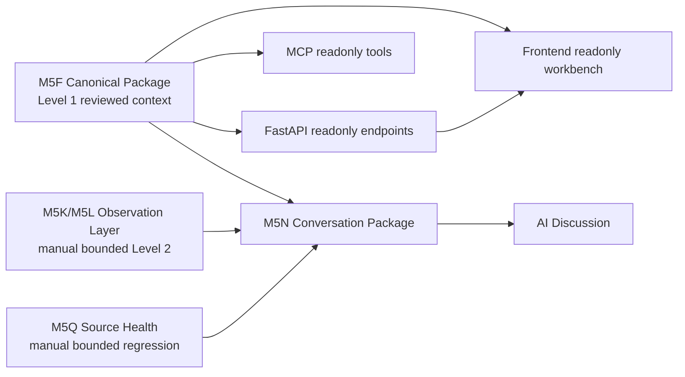

# TW-Market Live Data Intelligence

## Project Overview

This final M5 README is the current product entry point. Historical context is preserved, including the pre-M5LRM archive at [`docs/archive/readme/README_20260630_M5LRM_ARCHITECTURE_CONVERGENCE.md`](docs/archive/readme/README_20260630_M5LRM_ARCHITECTURE_CONVERGENCE.md) and the pre-M5R archive at [`docs/archive/readme/README_PRE_M5R_20260630_PRODUCT_RELEASE_HARDENING.md`](docs/archive/readme/README_PRE_M5R_20260630_PRODUCT_RELEASE_HARDENING.md). Legacy controlled refresh/probe publication paths remain disabled pending M5I authorization and are not current product surfaces.

## 1. What this project is

TW-Market Live Data Intelligence is an AI-native, local-first Taiwan market data workbench. It packages reviewed canonical context, manual bounded observation, source-health evidence, FastAPI readonly endpoints, a readonly browser workbench, and MCP readonly tools so a maintainer or operator can discuss Taiwan market context with an AI assistant while preserving evidence, caveats, source timestamps, retrieval timestamps, and governance boundaries.

Current release status: **Local Release Candidate**.

## 2. What this project is not

This project is **Not Production Ready**, **not realtime guaranteed**, **not a trading system**, and not an investment-advice product.

It provides: **No buy/sell/hold**, **No recommendation**, **No ranking**, **No target price**, **No broker/auth**, **No automatic orders**, **No polling**, **No scheduler**, and **No full-market scan**.

## 3. Product architecture



## 4. Mode A / Mode B / Mode C

- **Mode A — Canonical only:** validate and inspect the M5F canonical package. No network calls. No writes outside normal validation output.
- **Mode B — Planning + bounded observation readiness:** inspect watchlist, source routes, source health, and route plans. Planning is no-network; execution is manual and bounded only.
- **Mode C — AI Conversation Package:** build the local Conversation Package and paste the reviewed context into an AI chat with all safety caveats intact.

## 5. Level 1 / Level 2

- **Level 1:** validated canonical context in `research/staging/m5f/m5f_canonical_market_context_01/`. It is reviewed and reproducible, but historical and not current realtime market state.
- **Level 2:** temporary bounded observation/source-health context under `research/live_observation_runs/`. It is non-canonical and never mutates M5F.

## 6. Quick start

```bash
python -m pip install -r requirements.txt
python -m compileall scripts server tests
pytest -m "not network" -v
```

## 7. Validate the repository

```bash
python scripts/validate_m5f_canonical_market_context_package.py --package-dir research/staging/m5f/m5f_canonical_market_context_01
python scripts/run_m5ij_end_to_end_acceptance.py --check-only
python scripts/run_m5q_source_health_probe.py --check-only
```

Full release validation is documented in [`docs/release/RELEASE_CHECKLIST.md`](docs/release/RELEASE_CHECKLIST.md).

## 8. Run FastAPI

```bash
uvicorn server.main:app --host 127.0.0.1 --port 8000
```

Safe local entry points include `/api/health`, `/api/context/canonical`, `/api/context/snapshot`, `/api/watchlist`, `/api/conversation/context`, `/api/m5k/live-observation/plan`, and `/api/source-health/latest`. Legacy `/api/probe/*` routes are fail-closed/disabled and not current product surfaces.

## 9. Use frontend readonly workbench

Open `frontend/readonly-preview/M5KLocalAIWorkbench.html` in a browser or serve it locally with your preferred static server. The workbench is readonly/local-first and must not publish into `frontend/public`.

## 10. Use MCP readonly tools

```bash
python server/mcp_server.py --startup-check
```

Then connect your MCP client to `python server/mcp_server.py`. Current tools are documented in [`docs/reference/MCP_REFERENCE.md`](docs/reference/MCP_REFERENCE.md).

## 11. Run bounded live observation

Bounded live observation is explicit/manual only. It may perform network calls only after the operator intentionally executes the command and remains limited to the supplied watchlist.

```bash
python scripts/run_m5k_live_observation.py --watchlist config/m5k_default_watchlist.json --execute-live-observation --confirm-live-observation
```

Do not schedule it, poll it, expand it to a full-market scan, or promote it to M5F.

## 12. Build Conversation Package

```bash
python scripts/build_m5n_conversation_context.py
```

Use the generated temporary context for AI discussion, not as a canonical market-data refresh.

## 13. Source matrix summary

| Source/artifact | Role | Realtime status | Default usage |
|---|---|---|---|
| TWSE_OpenAPI | Official reference data | Not realtime guaranteed | Level 1 canonical evidence and reference checks |
| TWSE_MIS | Browser JSON observation candidate | Not realtime guaranteed | Manual bounded Level 2 observation candidate |
| TAIFEX_MIS | Browser JSON observation candidate | Not realtime guaranteed | Manual bounded futures observation candidate |
| M5F Canonical Package | Reviewed local package | Historical/stale | Mode A baseline |
| M5Q Source Health | Manual bounded health report | Status at retrieval only | Source usability checks |
| M5N Conversation Package | AI handoff | Derived local context | Mode C discussion |

See [`docs/reference/SOURCE_MATRIX.md`](docs/reference/SOURCE_MATRIX.md) and [`docs/reference/CAPABILITY_MATRIX.md`](docs/reference/CAPABILITY_MATRIX.md).

## 14. Safety / governance boundaries

No M5F mutation, no observation logic change, no source adapter logic change, no source-health logic change, no conversation builder logic change, no FastAPI or MCP contract change, no frontend behavior change, no `frontend/public` write, no `research/generated` write, no `production`/`prod` write, no credentials, no broker/auth, no startup network calls, no trading output.

## 15. Repository layout

```text
config/                         Watchlists and source adapter matrix
docs/                           Product, operator, reference, contributor, release docs
frontend/readonly-preview/      Local readonly browser workbench
research/staging/m5f/           Level 1 canonical package
research/live_observation_runs/ Level 2 temporary observation and source-health runs
scripts/                        Validators, builders, governance checks, bounded runners
server/                         FastAPI and MCP local surfaces
tests/                          Non-network regression tests and fixtures
```

## 16. Documentation map

Start at [`docs/INDEX.md`](docs/INDEX.md). Fast paths: [`docs/operator/QUICK_START.md`](docs/operator/QUICK_START.md), [`docs/operator/MODE_ABC_WALKTHROUGH.md`](docs/operator/MODE_ABC_WALKTHROUGH.md), [`docs/architecture/PRODUCT_ARCHITECTURE.md`](docs/architecture/PRODUCT_ARCHITECTURE.md), and [`docs/release/M5_LOCAL_RELEASE_CANDIDATE.md`](docs/release/M5_LOCAL_RELEASE_CANDIDATE.md).

## 17. Release status

**Local Release Candidate**: suitable for local validation, readonly FastAPI/frontend/MCP use, manual bounded observation, source-health checks, and AI conversation handoff. **Not Production Ready** and **not realtime guaranteed**.

## 18. Roadmap

M5 is closed by this release-hardening PR. Future work should begin after merge, avoid parallel contracts, preserve governance tests, and continue evidence-based source evaluation without adding trading behavior.
