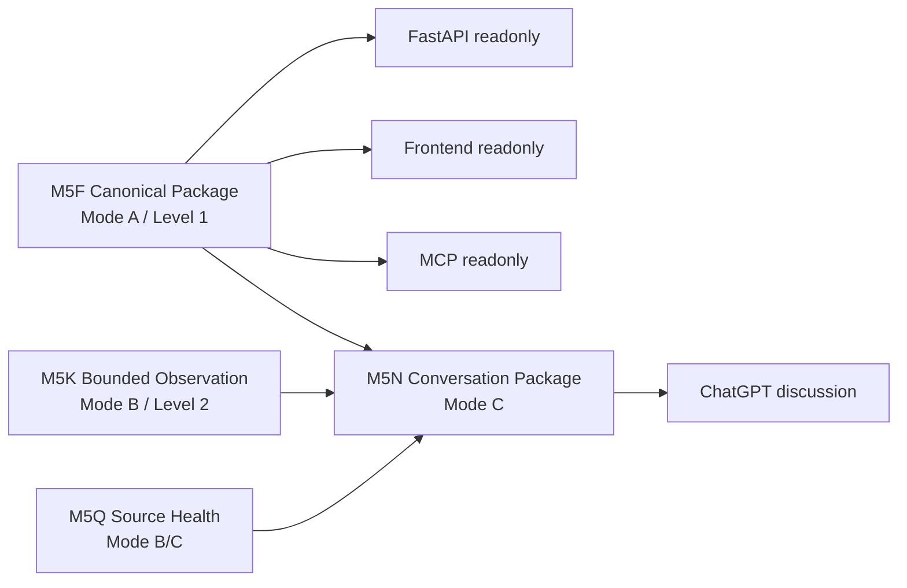

# TW-Market Live Data Intelligence

## Project Overview

Historical context is preserved in [`docs/archive/readme/README_20260630_M5LRM_ARCHITECTURE_CONVERGENCE.md`](docs/archive/readme/README_20260630_M5LRM_ARCHITECTURE_CONVERGENCE.md).


TW-Market Live Data Intelligence is a local-first, AI-native Taiwan market data workbench for operators who need governed context, bounded observation evidence, source-health diagnostics, and a safe Conversation Package for ChatGPT discussion.

It is a **Local Release Candidate**. It is not production ready and it does not guarantee realtime prices. Legacy controlled refresh/probe publication paths are disabled pending M5I authorization and are not current product surfaces.

## Who is it for?

- Human operators validating and discussing Taiwan market context with an AI assistant.
- Maintainers preserving evidence, timestamps, source caveats, and governance boundaries.
- Researchers comparing official, unofficial, commercial, and browser-rendered market-data paths.

## What can it do?

- Read and validate the reviewed **M5F canonical package** (Mode A).
- Plan and optionally execute explicit, manual, bounded **M5K observations** (Mode B).
- Read **M5Q source-health** diagnostics.
- Build an **M5N Conversation Package** for ChatGPT (Mode C).
- Serve readonly FastAPI, frontend, and MCP local surfaces.
- Provide an offline operator dashboard and release preflight.

## What can it NOT do?

No trading, no buy/sell/hold, no recommendations, no ranking, no target prices, no broker/auth, no automatic orders, no polling, no scheduler, no startup network calls, no full-market scans, and no realtime guarantee.

## Start here

```bash
python -m pip install -r requirements.txt
python scripts/run_local_workbench.py
```

The local workbench is offline by default. It checks repository version, Python/dependencies, directory structure, M5F, latest observation, latest source health, latest conversation package, FastAPI/frontend/MCP entry points, and recommended next action.

For the full operator path, see [`docs/operator/LOCAL_WORKBENCH.md`](docs/operator/LOCAL_WORKBENCH.md).

## Typical daily workflow

```bash
python scripts/run_local_workbench.py
python scripts/validate_m5f_canonical_market_context_package.py --package-dir research/staging/m5f/m5f_canonical_market_context_01
# Optional, explicit, bounded Mode B only when needed:
python scripts/run_m5k_live_observation.py --watchlist config/m5k_default_watchlist.json --execute-live-observation
python scripts/build_m5n_conversation_context.py
```

Review `research/live_observation_runs/current_conversation_context/conversation_context.md` before sending governed context to ChatGPT.

## Typical release workflow

```bash
python scripts/run_operator_preflight.py
```

The preflight reuses existing validators and reports `PASS`, `PASS WITH CAVEATS`, or `FAIL` without performing live observation.

Full release validation remains in [`docs/release/RELEASE_CHECKLIST.md`](docs/release/RELEASE_CHECKLIST.md).

## Architecture overview



Mode semantics are fixed: **Mode A = Canonical Context**, **Mode B = Bounded Observation**, and **Mode C = Conversation Package**. M5F is canonical; M5K is bounded observation; M5Q is source health; M5N is conversation package. Observation is not canonical, reference-only is not current price, and `stale_or_closed_session` is degraded.


## Data capability map

This repo includes canonical local context, bounded live observation, conversation context, source health, and several source-family contracts, including live observation, official EOD/canonical, source-health, and future credential-gated families. The full source/field/AI-context capability inventory is in [`docs/data_capabilities/VALIDATED_ENDPOINT_DATA_CAPABILITY_INVENTORY.md`](docs/data_capabilities/VALIDATED_ENDPOINT_DATA_CAPABILITY_INVENTORY.md), with machine-readable data in [`docs/data_capabilities/validated_endpoint_data_capability_inventory.json`](docs/data_capabilities/validated_endpoint_data_capability_inventory.json). Raw availability does not mean every field is currently normalized or exposed. All AI usage is context-only, caveated, and non-trading.

## Test execution profiles

Do not optimize for test count. Optimize for operator journey coverage, risk coverage, and the correct execution profile for the change. M6K defines explicit profiles in `config/test_execution_profiles.json` and routes them through `scripts/run_test_profile.py`:

```bash
python scripts/run_test_profile.py fast --json
python scripts/run_test_profile.py default-ci --json
python scripts/run_test_profile.py full-non-network --json
python scripts/run_test_profile.py operator-preflight --json
python scripts/run_test_profile.py browser-e2e --json
python scripts/run_test_profile.py bounded-live --confirm-bounded-live --ssl-policy compatibility
```

Normal PR CI runs DEFAULT_CI, not the entire non-network suite. FULL_NON_NETWORK preserves the broad `pytest -m "not network"` safety net for release preparation and large refactors. Operator preflight, browser E2E, and bounded live checks remain separate. Optional browser E2E dependencies are installed with `requirements-browser-e2e.txt`; normal DEFAULT_CI does not install Playwright, Chromium, or OS browser dependencies. Strict TLS remains default; compatibility TLS is explicit opt-in only for bounded/live operator commands.

## Local services

FastAPI:

```bash
uvicorn server.main:app --host 127.0.0.1 --port 8000
```

Frontend: open [`frontend/readonly-preview/M5KLocalAIWorkbench.html`](frontend/readonly-preview/M5KLocalAIWorkbench.html).

MCP startup check:

```bash
python server/mcp_server.py --startup-check
```

## Documentation map

Start at [`docs/INDEX.md`](docs/INDEX.md). Recommended operator path:

- [`docs/operator/LOCAL_WORKBENCH.md`](docs/operator/LOCAL_WORKBENCH.md)
- [`docs/operator/MODE_ABC_WALKTHROUGH.md`](docs/operator/MODE_ABC_WALKTHROUGH.md)
- [`docs/operator/TROUBLESHOOTING.md`](docs/operator/TROUBLESHOOTING.md)
- [`docs/reference/GOVERNANCE_BOUNDARIES.md`](docs/reference/GOVERNANCE_BOUNDARIES.md)
- [`docs/reference/API_REFERENCE.md`](docs/reference/API_REFERENCE.md)
- [`docs/reference/SOURCE_MATRIX.md`](docs/reference/SOURCE_MATRIX.md)
- [`docs/reference/CAPABILITY_MATRIX.md`](docs/reference/CAPABILITY_MATRIX.md)

## Important governance boundaries

Do not mutate M5F, change observation/source-health/conversation semantics, create parallel contracts, write `frontend/public` or `research/generated`, bypass authentication, add credentials, introduce startup network calls, schedule/poll observations, scan the full market, expose raw payloads unnecessarily, or produce trading outputs.

## Repository layout

```text
config/                         Watchlists and source adapter matrix
docs/                           Product, operator, reference, contributor, release docs
frontend/readonly-preview/      Local readonly browser workbench
research/staging/m5f/           Level 1 canonical package
research/live_observation_runs/ Level 2 observation/source-health/conversation artifacts
scripts/                        Validators, builders, diagnostics, bounded runners
server/                         FastAPI and MCP local surfaces
tests/                          Non-network regression tests and fixtures
```


## M6D SSL/TLS compatibility policy

Strict TLS verification remains the default for explicit live observation and source-contract preflight. Operators may select `--ssl-policy strict`, `--ssl-policy compatibility`, or `--ssl-policy unsafe-explicit`; the CLI flag takes precedence over `TW_MARKET_SSL_POLICY`, which takes precedence over the strict default. Compatibility mode is explicit and diagnostic for known Windows/Python 3.13 certificate compatibility failures. No silent TLS fallback exists. Do not use unsafe-explicit unless you understand TLS verification is disabled.

Example bounded commands:

```bash
python scripts/run_m5k_live_observation.py --watchlist config/m5k_default_watchlist.json --execute-live-observation --ssl-policy strict
python scripts/run_m5k_live_observation.py --watchlist config/m5k_default_watchlist.json --execute-live-observation --ssl-policy compatibility
python scripts/run_m6b_source_contract_preflight.py --execute-live-contract-check --ssl-policy strict
```

Diagnostics and workbench commands remain no-network unless an explicit live command is run.

## M6E operator acceptance

Run `python scripts/run_m6e_operator_acceptance.py --check-only` for the M6E operator acceptance layer. It is non-network by default, aggregates existing diagnostics/validators, verifies readonly FastAPI/MCP/frontend contracts, and writes reports under `research/live_observation_runs/m6e_operator_acceptance/`.

## M6G browser/operator E2E acceptance

Run `python scripts/run_m6g_browser_operator_e2e.py --check-only` to verify the local FastAPI plus actual readonly frontend operator path. Browser dependencies are optional for default CI; if Playwright/Chromium is missing, the script writes `skipped_with_caveats` with install instructions. Full browser execution requires `python -m pip install playwright` and `python -m playwright install chromium`. Explicit bounded live mode is manual only: `python scripts/run_m6g_browser_operator_e2e.py --execute-bounded-live-check --ssl-policy compatibility` or `--ssl-policy strict`.
