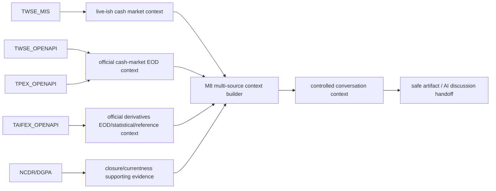
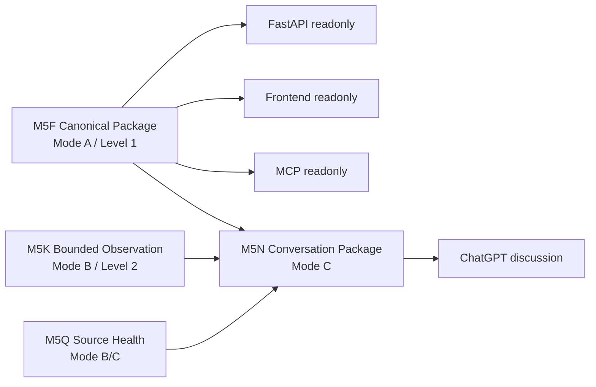

# TW-Market Live Data Intelligence

## Project Overview

Historical context is preserved in [`docs/archive/readme/README_20260630_M5LRM_ARCHITECTURE_CONVERGENCE.md`](docs/archive/readme/README_20260630_M5LRM_ARCHITECTURE_CONVERGENCE.md).


TW-Market Live Data Intelligence is a local-first, AI-native Taiwan market data workbench for operators who need governed context, bounded observation evidence, source-health diagnostics, and a safe Conversation Package for ChatGPT discussion.

It is a **Local Release Candidate**. It is not production ready and it does not guarantee realtime prices. Legacy controlled refresh/probe publication paths are disabled pending M5I authorization and are not current product surfaces.

## Who is it for?

- Human operators validating and discussing Taiwan market context with an AI assistant.
- Maintainers preserving evidence, timestamps, source caveats, and governance boundaries.
- Researchers comparing official, unofficial, commercial, and browser-rendered market-data paths.

## What can it do?

- Read and validate the reviewed **M5F canonical package** (Mode A).
- Plan and optionally execute explicit, manual, bounded **M5K observations** (Mode B).
- Read **M5Q source-health** diagnostics.
- Build an **M5N Conversation Package** for ChatGPT (Mode C).
- Serve readonly FastAPI, frontend, and MCP local surfaces.
- Provide an offline operator dashboard and release preflight.

## What can it NOT do?

No trading, no buy/sell/hold, no recommendations, no ranking, no target prices, no broker/auth, no automatic orders, no polling, no scheduler, no startup network calls, no full-market scans, and no realtime guarantee.

## Start here

```bash
python -m pip install -r requirements.txt
python scripts/run_local_workbench.py
```

The local workbench is offline by default. It checks repository version, Python/dependencies, directory structure, M5F, latest observation, latest source health, latest conversation package, FastAPI/frontend/MCP entry points, and recommended next action.

For the full operator path, see [`docs/operator/LOCAL_WORKBENCH.md`](docs/operator/LOCAL_WORKBENCH.md).

## Typical daily workflow

```bash
python scripts/run_local_workbench.py
python scripts/validate_m5f_canonical_market_context_package.py --package-dir research/staging/m5f/m5f_canonical_market_context_01
# Optional, explicit, bounded Mode B only when needed:
python scripts/run_m5k_live_observation.py --watchlist config/m5k_default_watchlist.json --execute-live-observation
python scripts/build_m5n_conversation_context.py
```

Review `research/live_observation_runs/current_conversation_context/conversation_context.md` before sending governed context to ChatGPT.

## Typical release workflow

```bash
python scripts/run_operator_preflight.py
```

The preflight reuses existing validators and reports `PASS`, `PASS WITH CAVEATS`, or `FAIL` without performing live observation.

Full release validation remains in [`docs/release/RELEASE_CHECKLIST.md`](docs/release/RELEASE_CHECKLIST.md).


## Current M8 architecture (M8 through M8B)

M8 adds governed, source-attributed market context on top of the historical M5 local workbench. It is still local-first and operator-controlled: no scheduler, no polling, no startup fetch, no database persistence, no model call, and no trading recommendation.



`TAIFEX_MIS` has staged M8C-02 controlled M8 context code pending remote validation. AI value context remains disabled until exact remote-code bounded TX/MTX/monthly-TXO validation closes; it remains not realtime guaranteed, and delta support, after-hours support, weekly options, reconnect, unsubscribe, public API, raw payload exposure, recommendations, rankings, and trading signals remain disabled.

### M8 validation examples

M8A bounded official cash-market latest-EOD validation:

```bash
python scripts/validate_m8a_official_eod_live.py \
  --sources TWSE_OPENAPI,TPEX_OPENAPI \
  --symbols 2330,0050,8069,006201 \
  --confirm
```

M8B bounded TAIFEX official derivatives validation. The options scope is bounded by product, contract month/week, strike, and option type; Put/Call Ratio and final-settlement retention are bounded by runtime defaults.

```bash
python scripts/validate_m8b_taifex_openapi_live.py \
  --contexts futures_eod,options_eod,final_settlement,large_trader_oi_futures,large_trader_oi_options,put_call_ratio,block_trade \
  --products TX,MTX,TXO \
  --contract-month 202607 \
  --strike 23000 \
  --option-type call \
  --delivery-month 202607 \
  --settlement-month 202607 \
  --trader-type all \
  --pcr-latest-n 1 \
  --max-pcr-rows 20 \
  --final-settlement-latest-n 1 \
  --max-final-settlement-rows 50 \
  --max-block-trade-rows 100 \
  --max-large-trader-oi-rows 100 \
  --session regular \
  --confirm
```

### M8 source capability table

| Source | Role | Timing | Runtime status | Operator gate | Retained scope | Major caveat |
|---|---|---|---|---|---|---|
| TWSE_MIS | live-ish cash quote snapshot | intraday snapshot | executable | yes | bounded watchlist | not realtime guaranteed |
| TWSE_OPENAPI | official listed cash EOD | latest EOD | executable | yes | bounded symbols | no historical backfill |
| TPEX_OPENAPI | official TPEx cash EOD | latest EOD | executable | yes | bounded symbols | no canonical security master |
| TAIFEX_OPENAPI | official derivatives EOD/statistical/reference | official EOD/reference | executable | yes | bounded selectors/row limits | product/session metadata caveats |
| TAIFEX_MIS | regular-session futures/options live-ish initial state | M8C-02 context code staged pending validation | controlled executable only | raw payload retained=false | AI value context disabled pending validation | staged |
| NCDR_DGPA_CLOSURE_CAP | supporting closure evidence | event/reference | supporting evidence | yes | compact evidence | not TAIFEX-specific confirmation |

## Architecture overview



Mode semantics are fixed: **Mode A = Canonical Context**, **Mode B = Bounded Observation**, and **Mode C = Conversation Package**. M5F is canonical; M5K is bounded observation; M5Q is source health; M5N is conversation package. Observation is not canonical, reference-only is not current price, and `stale_or_closed_session` is degraded.


## Data capability map

This repo includes canonical local context, bounded live observation, conversation context, source health, validated runtime sources, validated contracts/probes, validated historical workbench sources, catalogued candidates, and credential-gated providers. It distinguishes `TAIFEX_MIS` as the bounded intraday observation source family from `TAIFEX_OpenAPI` as the official OpenAPI/OAS endpoint inventory for EOD/statistical/reference context planning. TAIFEX_OPENAPI is implemented in M8B-01 as official TAIFEX derivatives EOD/statistical/reference context. Controlled runtime adapters cover futures/options daily reports, final settlement, large-trader OI concentration, Put/Call Ratio, and block trades. It is not realtime, not TAIFEX_MIS, and produces no trading signals or recommendations. The full source/field/AI-context capability inventory is in [`docs/data_capabilities/VALIDATED_ENDPOINT_DATA_CAPABILITY_INVENTORY.md`](docs/data_capabilities/VALIDATED_ENDPOINT_DATA_CAPABILITY_INVENTORY.md), with machine-readable data in [`docs/data_capabilities/validated_endpoint_data_capability_inventory.json`](docs/data_capabilities/validated_endpoint_data_capability_inventory.json). Not every listed source family is a validated usable endpoint, and raw availability does not mean every field is currently parsed, normalized, retained, or exposed. All AI usage is context-only, caveated, and non-trading.

## Test execution profiles

Do not optimize for test count. Optimize for operator journey coverage, risk coverage, and the correct execution profile for the change. M6K defines explicit profiles in `config/test_execution_profiles.json` and routes them through `scripts/run_test_profile.py`:

```bash
python scripts/run_test_profile.py fast --json
python scripts/run_test_profile.py default-ci --json
python scripts/run_test_profile.py full-non-network --json
python scripts/run_test_profile.py operator-preflight --json
python scripts/run_test_profile.py browser-e2e --json
python scripts/run_test_profile.py bounded-live --confirm-bounded-live --ssl-policy compatibility
```

Normal PR CI runs DEFAULT_CI, not the entire non-network suite. FULL_NON_NETWORK preserves the broad `pytest -m "not network"` safety net for release preparation and large refactors. Operator preflight, browser E2E, and bounded live checks remain separate. Optional browser E2E dependencies are installed with `requirements-browser-e2e.txt`; normal DEFAULT_CI does not install Playwright, Chromium, or OS browser dependencies. Strict TLS remains default; compatibility TLS is explicit opt-in only for bounded/live operator commands.

## Local services

FastAPI:

```bash
uvicorn server.main:app --host 127.0.0.1 --port 8000
```

Frontend: open [`frontend/readonly-preview/M5KLocalAIWorkbench.html`](frontend/readonly-preview/M5KLocalAIWorkbench.html).

MCP startup check:

```bash
python server/mcp_server.py --startup-check
```

## Documentation map

Start at [`docs/INDEX.md`](docs/INDEX.md). Recommended operator path:

- [`docs/operator/LOCAL_WORKBENCH.md`](docs/operator/LOCAL_WORKBENCH.md)
- [`docs/operator/MODE_ABC_WALKTHROUGH.md`](docs/operator/MODE_ABC_WALKTHROUGH.md)
- [`docs/operator/TROUBLESHOOTING.md`](docs/operator/TROUBLESHOOTING.md)
- [`docs/reference/GOVERNANCE_BOUNDARIES.md`](docs/reference/GOVERNANCE_BOUNDARIES.md)
- [`docs/reference/API_REFERENCE.md`](docs/reference/API_REFERENCE.md)
- [`docs/reference/SOURCE_MATRIX.md`](docs/reference/SOURCE_MATRIX.md)
- [`docs/reference/CAPABILITY_MATRIX.md`](docs/reference/CAPABILITY_MATRIX.md)

## Important governance boundaries

Do not mutate M5F, change observation/source-health/conversation semantics, create parallel contracts, write `frontend/public` or `research/generated`, bypass authentication, add credentials, introduce startup network calls, schedule/poll observations, scan the full market, expose raw payloads unnecessarily, or produce trading outputs.

## Repository layout

```text
config/                         Watchlists and source adapter matrix
docs/                           Product, operator, reference, contributor, release docs
frontend/readonly-preview/      Local readonly browser workbench
research/staging/m5f/           Level 1 canonical package
research/live_observation_runs/ Level 2 observation/source-health/conversation artifacts
scripts/                        Validators, builders, diagnostics, bounded runners
server/                         FastAPI and MCP local surfaces
tests/                          Non-network regression tests and fixtures
```


## M6D SSL/TLS compatibility policy

Strict TLS verification remains the default for explicit live observation and source-contract preflight. Operators may select `--ssl-policy strict`, `--ssl-policy compatibility`, or `--ssl-policy unsafe-explicit`; the CLI flag takes precedence over `TW_MARKET_SSL_POLICY`, which takes precedence over the strict default. Compatibility mode is explicit and diagnostic for known Windows/Python 3.13 certificate compatibility failures. No silent TLS fallback exists. Do not use unsafe-explicit unless you understand TLS verification is disabled.

Example bounded commands:

```bash
python scripts/run_m5k_live_observation.py --watchlist config/m5k_default_watchlist.json --execute-live-observation --ssl-policy strict
python scripts/run_m5k_live_observation.py --watchlist config/m5k_default_watchlist.json --execute-live-observation --ssl-policy compatibility
python scripts/run_m6b_source_contract_preflight.py --execute-live-contract-check --ssl-policy strict
```

Diagnostics and workbench commands remain no-network unless an explicit live command is run.

## M6E operator acceptance

Run `python scripts/run_m6e_operator_acceptance.py --check-only` for the M6E operator acceptance layer. It is non-network by default, aggregates existing diagnostics/validators, verifies readonly FastAPI/MCP/frontend contracts, and writes reports under `research/live_observation_runs/m6e_operator_acceptance/`.

## M6G browser/operator E2E acceptance

Run `python scripts/run_m6g_browser_operator_e2e.py --check-only` to verify the local FastAPI plus actual readonly frontend operator path. Browser dependencies are optional for default CI; if Playwright/Chromium is missing, the script writes `skipped_with_caveats` with install instructions. Full browser execution requires `python -m pip install playwright` and `python -m playwright install chromium`. Explicit bounded live mode is manual only: `python scripts/run_m6g_browser_operator_e2e.py --execute-bounded-live-check --ssl-policy compatibility` or `--ssl-policy strict`.

## M8A official EOD context capability

M8A adds governed official latest EOD context alongside bounded live-ish TWSE_MIS observations. The repository now supports TWSE_MIS bounded live-ish market observation, official TWSE latest EOD context, official TPEx latest EOD context, source authority/provenance, currentness evaluation, emergency-closure-aware market-day resolution, bounded safe artifact generation, and AI-readable multi-source context.

| Source | Role | Timing | Market | Runtime mode | Primary caveat |
|---|---|---|---|---|---|
| `TWSE_MIS` | bounded browser-observed market snapshot | live-ish intraday snapshot | listed / TPEx route | controlled bounded refresh | not streaming or realtime guaranteed |
| `TWSE_OPENAPI` | official latest EOD market data | official EOD | listed | explicit operator-confirmed adapter execution | latest-only; not realtime |
| `TPEX_OPENAPI` | official latest EOD market data | official EOD | OTC mainboard | explicit operator-confirmed adapter execution | latest-only; mixed instruments require classification |
| `NCDR_DGPA_CLOSURE_CAP` | emergency closure evidence only | dynamic emergency event | Taiwan work-closure evidence | queried only for mismatch/currentness resolution | not market price data |

Controlled official EOD execution requires explicit operator confirmation and bounded requested symbols. TWSE/TPEx official EOD endpoints are whole-market network fetches, but adapters immediately filter to requested symbols and do not retain raw full-market payloads. There is no automatic polling, background scheduler, startup fetch, hidden fetch, or database write.

Currentness is resolved as:

```text
scheduled trading calendar
+ emergency closure evidence
+ official source trade date
= actual expected latest completed trade date
```

For this project, a confirmed Taipei City full-day or morning work suspension is treated as closing TWSE and TPEx for the full market day. `NCDR_DGPA_CLOSURE_CAP` is used only as exception/currentness evidence and is not a market data or price source.

Example deterministic checks:

```bash
python -m pytest tests/unit/test_m8a*.py -q
python scripts/run_test_profile.py default-ci --json
```

Example explicit bounded live validation:

```bash
python scripts/validate_m8a_official_eod_live.py \
  --sources TWSE_OPENAPI,TPEX_OPENAPI \
  --symbols 2330,0050,8069,006201 \
  --confirm
```

Limitations: M8A endpoints are latest-only, no historical backfill is included, mixed TPEx instruments depend on exact security-master classification, NCDR is exception/currentness evidence only, no scheduler/polling is added, and the project does not implement an investment recommendation engine. The current repository does not contain a complete canonical production security master; M8A therefore marks production classification completeness as incomplete and uses a bounded seed only until a complete canonical master is added. Unknown symbols continue to fail closed.

Review note: PR #126 was reviewed as a squashed single GitHub commit even though the earlier implementation report described a four-commit local execution structure. Current reports should describe the actual GitHub commit shape rather than claiming four reviewable commits.
