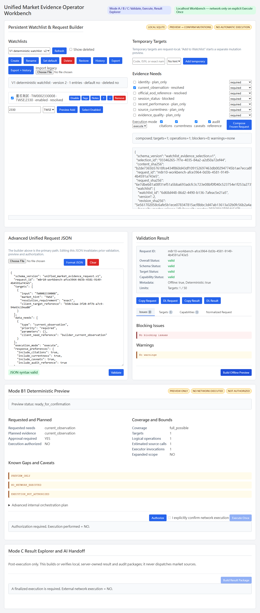

# TW-Market Live Data Intelligence

[English](README.md) | [繁體中文](README.zh-TW.md)

> 提供給操作人員與 AI 助理的本機優先、受治理台灣市場證據工作台：先驗證、再預覽受界限的工作，僅在能力允許時明確授權一次執行。



ProductVersion = `1.0.0`。目前 stable release 是 **[`v1.0.0`](https://github.com/SmartyJohnway/tw-market-live-data-intelligence/releases/tag/v1.0.0)**；已發布的 prerelease 歷史版本為 [`v1.0.0-rc.1`](https://github.com/SmartyJohnway/tw-market-live-data-intelligence/releases/tag/v1.0.0-rc.1)，較早的 stable GitHub Release 是 `v0.1.0`。目前開發線的 Phase G G1/G2 能力已通過受界限 controlled-live 驗收。它是本機優先的證據工作台，不是即時交易產品。

## 快速開始

```bash
git clone https://github.com/SmartyJohnway/tw-market-live-data-intelligence.git
cd tw-market-live-data-intelligence
python -m venv .venv
# 依你的 shell 啟用 .venv，然後：
python -m pip install -r requirements-lock.txt
python scripts/verify_environment.py
python scripts/manage_security_master.py status
```

全新安裝顯示 `NOT_INITIALIZED` 是正常狀態。更新 Security Master 是明確的操作人員動作，且可能進行官方外部取得：

```bash
python scripts/manage_security_master.py update --live
python scripts/run_unified_workbench.py
```

在瀏覽器開啟本機回送 Workbench：[`/workbench/`](http://127.0.0.1:8000/workbench/)。MCP host 請另行啟動 stdio launcher：

```bash
python scripts/run_unified_market_evidence_mcp.py
```

完整流程請見[操作人員快速開始](docs/operator/QUICK_START.md)、[V1 公開契約](docs/contracts/V1_PUBLIC_CONTRACTS.md)與[文件索引](docs/INDEX.md)。

## 受治理的 2330 工作流程

1. 建立或選取安裝本機的 Watchlist，加入 `2330`。
2. 編寫 Unified Market Evidence Request，並驗證身分。
3. 預覽計畫操作與能力邊界。
4. 僅在預覽可執行時，明確授權並確認一次受界限執行。
5. 讀取 canonical Result 與 Audit Package，或匯出 AI-ready handoff 以繼續討論。

MCP 固定提供六個受治理工具：
`market_describe_capabilities`、`market_validate_request`、
`market_preview_request`、`market_read_result`、
`market_export_ai_handoff`、`market_fetch_evidence`。

Request v2 是現行偏好契約，Request v1 仍相容；新執行產生 Result v2 與 Audit Package v2，歷史 V1 套件保持可讀且不重寫。符合資格的 TWSE/TPEX 普通股可取得最新完成的官方重大訊息日批次，以及最新可得的月營收（TWD、千元）；來源先用官方 CSV，必要時明確使用受治理的官方 JSON OpenAPI fallback。初版不提供任意歷史查詢、即時重大訊息、`financial_summary`、投資建議或交易。

## MCP 發行套件

Windows MCPB 套件隨
[`v1.0.0`](https://github.com/SmartyJohnway/tw-market-live-data-intelligence/releases/tag/v1.0.0)發行：可[下載 MCPB](https://github.com/SmartyJohnway/tw-market-live-data-intelligence/releases/download/v1.0.0/tw-market-unified-mcp-v1.0.0-win-x64.mcpb)，並以其 [SHA-256 sidecar](https://github.com/SmartyJohnway/tw-market-live-data-intelligence/releases/download/v1.0.0/tw-market-unified-mcp-v1.0.0-win-x64.mcpb.sha256)驗證。它採用本機 stdio，並提供相同六個工具。官方 [MCP Registry entry](https://registry.modelcontextprotocol.io/v0.1/servers?search=io.github.SmartyJohnway/tw-market-live-data-intelligence) 是 `io.github.SmartyJohnway/tw-market-live-data-intelligence`；安裝範圍、完整性與 Security Master 邊界請見 [MCP 發行說明](docs/distribution/MCP_DISTRIBUTION.md)。

Persistent Watchlists 已支援，但僅在本機保存，且只可經由明確 preview/commit 變更。系統不提供自動輪詢、排程器、啟動時市場取得、Watchlist 驅動的自動執行、交易或即時性保證。

## 現行產品與歷史資料

根目錄 [README](README.md) 是英文產品入口；本文件是其繁體中文等價導覽。歷史 M5/M8 架構、驗收與研究資料保留作稽核用途，但不構成第二套現行產品權威。請由[文件索引](docs/INDEX.md)進入現行操作、架構與公開契約；歷史資料請由[專案歷史](docs/PROJECT_HISTORY.md)或 `docs/archive/` 查閱。

## 參與與安全回報

請先閱讀 [CONTRIBUTING.md](CONTRIBUTING.md)；安全問題請依 [SECURITY.md](SECURITY.md) 的安全回報流程處理。此專案禁止提交憑證、密鑰、cookie 或其他敏感資料。
