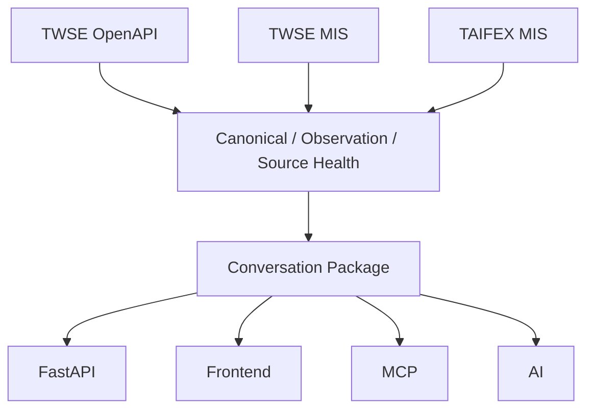

# Data Flow

TWSE OpenAPI is official reference-style evidence. TWSE MIS and TAIFEX MIS are browser endpoint observation candidates. Every path must keep source time, retrieval time, delay/freshness assessment, caveats, and raw payload policy visible.
