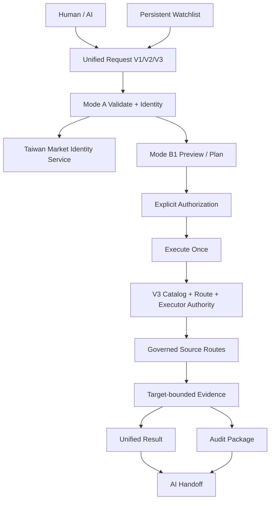

# Current Data Flow

```mermaid
flowchart TB
    U[Human / AI] --> REQ[Unified Request V1/V2/V3]
    REQ --> A[Mode A Validate + Identity]
    A --> SM[Taiwan Market Identity Service]
    A --> B1[Mode B1 Preview / Plan]
    B1 --> AUTH[Explicit Authorization]
    AUTH --> EX[Execute Once]
    EX --> ROUTE[V3 Catalog + Route + Executor Authority]
    ROUTE --> SRC[Governed Source Routes]
    SRC --> EVID[Target-bounded Evidence]
    EVID --> RES[Unified Result]
    EVID --> AUD[Audit Package]
    RES --> HAND[AI Handoff]
    AUD --> HAND

    WL[Persistent Watchlist] --> REQ
```

## Invariants

- identity resolution is separate from source execution;
- preview is non-network;
- authorization is explicit;
- execution is bounded by target/capability/route;
- source failure, missing evidence and unsupported scope remain distinct;
- Result/Audit/Handoff do not issue an extra market retrieval;
- V3 is preferred, but V1/V2 remain compatible;
- route activation remains independent from schema availability.

Historical M5F/M5K/M5N data-flow models remain engineering provenance, not the
current architecture.
