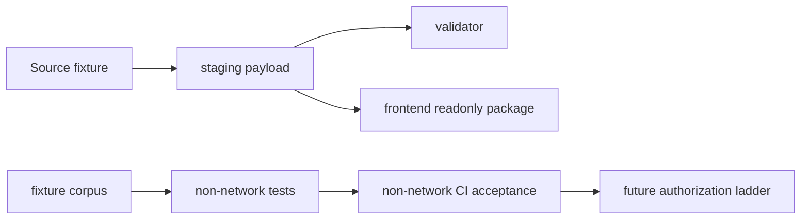

# Local-First Market Context Architecture

```mermaid
flowchart LR
  Source[Source fixture] --> Staging[staging payload]
  Staging --> Validator[validator]
  Staging --> Package[frontend readonly package]
  Fixtures[fixture corpus] --> Tests[non-network tests]
  Tests --> CI[non-network CI acceptance]
  CI --> Ladder[future authorization ladder]
```

This architecture is not production ready and does not authorize live probes or realtime claims.
