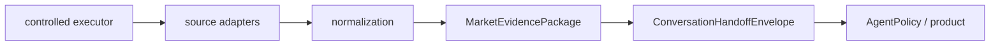

# M8R-03E R3 layer and dependency boundaries

## Ownership

* **Evidence** owns MarketEvidencePackage: identity, source/timing/currentness, observations, deterministic calculations, citations, lineage, coverage, and missing evidence.
* **Controlled execution** owns authorization scope/one-shot claim, network default-off, source/target limits, containment and retention.
* **Agent/deployment/product** owns AgentPolicy and ConversationHandoffEnvelope: advice, recommendation, signals, style, allowed topics, and disclosures.
* **Compatibility** owns deprecated historical fields, with their migration map; they cannot be used as current evidence truth.

Allowed imports flow left-to-right only. Evidence/source/execution modules must not import `config/agent_policy`, `docs/ai`, or product response policy. The architecture tests scan this boundary. Future Phase C may consume the evidence package through a bounded adapter, but may not reverse this dependency direction.

The canonical capability contract is `docs/ai/m8_ai_capability_contract.json`; the Skill asset is a checked-in mirror and is compared byte-for-byte by an R3 regression test. This is strategy A: canonical contract plus generated checked-in mirror; updates are explicit and deterministic rather than runtime document loading.
