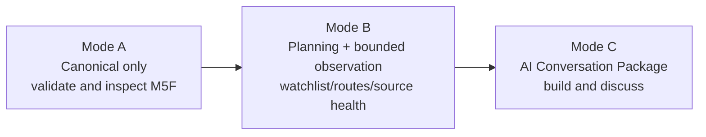
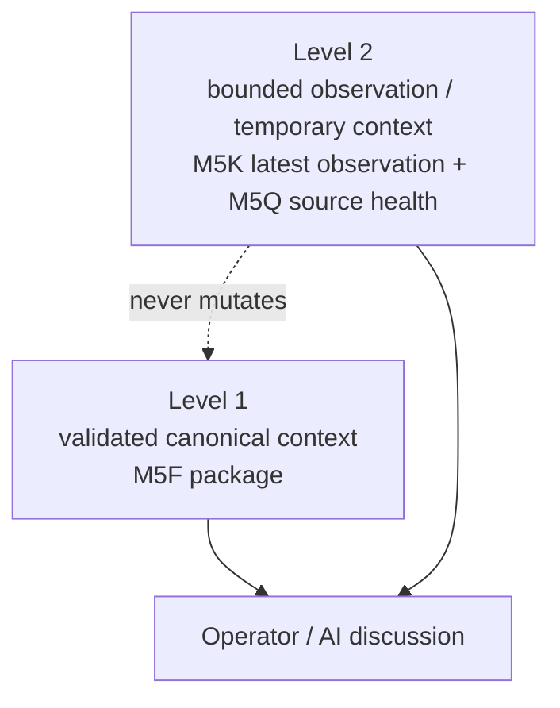

# Mode A/B/C and Level 1/2

## Mode diagram

## Level diagram

Mode A uses Level 1 only. Mode B plans or explicitly creates Level 2 temporary context. Mode C combines Level 1 and Level 2 summaries into the M5N Conversation Package.
