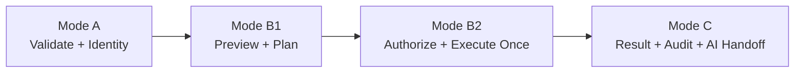

# Mode A/B/C — Current Unified Model

The names Mode A/B/C remain, but the current meaning is the Unified evidence
execution chain rather than the historical M5 Level-1/Level-2 package model.

```mermaid
flowchart LR
    A[Mode A
Validate + Identity] --> B1[Mode B1
Preview + Plan]
    B1 --> B2[Mode B2
Authorize + Execute Once]
    B2 --> C[Mode C
Result + Audit + AI Handoff]
```

## Mode A

- validate Request;
- resolve canonical identity;
- fail closed on ambiguous/unsupported identity;
- no market execution.

## Mode B1

- select current Catalog/Route/Executor authority;
- build deterministic bounded plan;
- expose blocked/omitted operations;
- no authorization or network.

## Mode B2

- bind explicit authorization to plan identity/hash;
- enforce approved operation/network scope;
- consume once;
- execute only current executable routes.

## Mode C

- materialize or verify canonical Result;
- materialize or verify Audit;
- export AI-safe handoff;
- no second market fetch.

## Compatibility

V3 is preferred. Explicit V1/V2 requests remain supported where their frozen
capability/routing contracts permit execution. Existing persisted packages keep
their stored version.

Historical "Level 1 / Level 2" documents remain useful provenance, but they no
longer define the current Mode A/B/C product contract.
