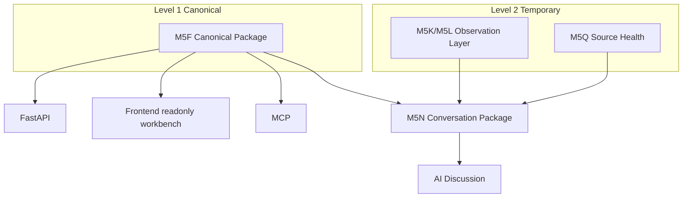

# Product Architecture

The product separates reviewed canonical context from temporary bounded observations. FastAPI, the frontend, and MCP expose local readonly context or explicit bounded tools; none are trading systems.
