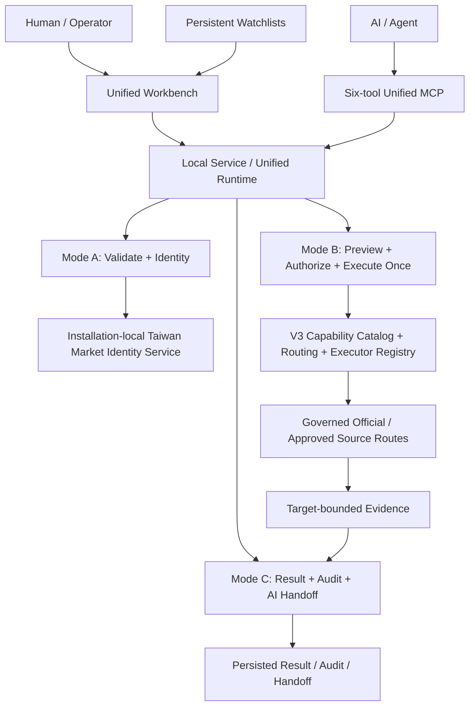

# Current Product Architecture

```mermaid
flowchart TB
    H[Human / Operator] --> WB[Unified Workbench]
    A[AI / Agent] --> MCP[Six-tool Unified MCP]
    WB --> LS[Local Service / Unified Runtime]
    MCP --> LS

    LS --> MA[Mode A: Validate + Identity]
    LS --> MB[Mode B: Preview + Authorize + Execute Once]
    LS --> MC[Mode C: Result + Audit + AI Handoff]

    MA --> SM[Installation-local Taiwan Market Identity Service]
    MB --> CAT[V3 Capability Catalog + Routing + Executor Registry]
    CAT --> SRC[Governed Official / Approved Source Routes]
    SRC --> EV[Target-bounded Evidence]
    EV --> MC

    WL[Persistent Watchlists] --> WB
    MC --> RES[Persisted Result / Audit / Handoff]
```

## Core properties

- local-first state and execution authority;
- installation-local Security Master;
- ISIN durable cash-security identity;
- `MARKET:CODE` listing/routing identity;
- Unified Request/Result family;
- V3 preferred, V1/V2 compatible;
- explicit preview/authorization/execute-once boundary;
- six MCP tools sharing the same runtime semantics as Workbench;
- bounded network acquisition;
- explicit missing/partial/failure/currentness semantics;
- no trading.

## Current Phase H shape

The architecture supports V3 Phase H contracts, but source activation remains
incremental. The current active source set contains only the TPEx attention H1
route. H2/H3 are not implicitly enabled by the architecture.

## Historical architecture

M5F/M5K/M5N and Level-1/Level-2 architecture documents are historical
provenance. They explain how the product evolved but are not the current product
architecture authority.
