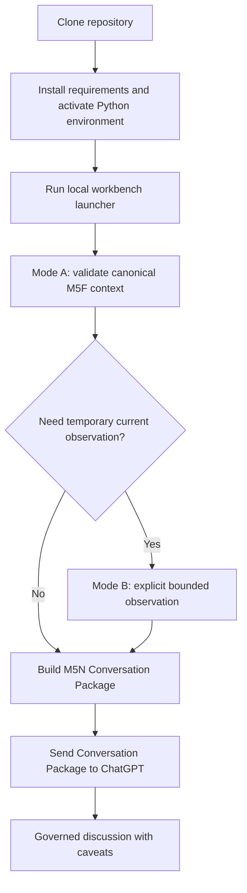
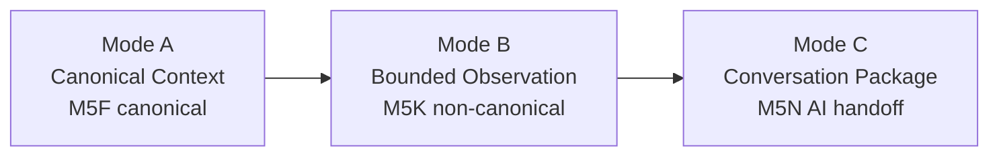

# Local Workbench and Operator Preflight

Start here when you want the repository to behave like a local product instead of a folder of scripts.

## Quick Start

```bash
python scripts/run_local_workbench.py
```

The launcher is offline by default. It does not start FastAPI, MCP, polling, schedulers, or live observation. It reports repository version, Python/dependency readiness, M5F availability, latest observation, latest source health, latest conversation package, frontend location, MCP startup-check command, and the recommended next operator action.

## Daily Workflow



## Mode Flow



Mode reminders:

- Mode A = Canonical Context.
- Mode B = Bounded Observation.
- Mode C = Conversation Package.
- M5F = canonical.
- M5K = bounded observation.
- M5Q = source health.
- M5N = conversation package.
- Observation != Canonical.
- Reference-only != Current Price.
- `stale_or_closed_session` = degraded.

## Observation Workflow

Live observation remains manual, explicit, and bounded:

```bash
python scripts/run_m5k_live_observation.py --watchlist config/m5k_default_watchlist.json --execute-live-observation
```

Do not schedule it, poll it, expand it to a full-market scan, or promote it to M5F.

## Conversation Workflow

```bash
python scripts/build_m5n_conversation_context.py
```

Then review `research/live_observation_runs/current_conversation_context/conversation_context.md` and send the relevant governed context to ChatGPT.

## Troubleshooting

Use the readonly diagnostic:

```bash
python scripts/run_environment_diagnostics.py
```

Common guided fixes:

- Observation not found: run `python scripts/run_m5k_live_observation.py --watchlist config/m5k_default_watchlist.json --execute-live-observation` only when temporary Mode B context is needed.
- Conversation missing: run `python scripts/build_m5n_conversation_context.py`.
- FastAPI unavailable: run `uvicorn server.main:app --host 127.0.0.1 --port 8000`.
- MCP startup unknown: run `python server/mcp_server.py --startup-check`.
- Dependencies missing: run `python -m pip install -r requirements.txt`.

## Release Workflow

```bash
python scripts/run_operator_preflight.py
```

The preflight aggregates existing validators wherever possible and reports `PASS`, `PASS WITH CAVEATS`, or `FAIL`. It does not perform live observation and does not duplicate M5F, M5K, M5Q, M5N, or M6B validation logic. Each child command defaults to a 300-second timeout; override it with `--timeout-seconds <int>` or `TW_MARKET_OPERATOR_PREFLIGHT_TIMEOUT_SECONDS`, with the CLI option taking precedence.

## Governance Boundaries

No polling, no scheduler, no startup network, no trading, no recommendation, no ranking, no target price, no buy/sell/hold, no broker/auth, no parallel contracts, and no M5F mutation.


## M6D Windows/Python 3.13 TLS compatibility diagnostics

`python scripts/run_local_workbench.py`, `python scripts/run_environment_diagnostics.py`, and `python scripts/run_operator_preflight.py` report OS platform, Python version, Python 3.13 detection, Windows detection, SSL default verify paths, configured `TW_MARKET_SSL_POLICY`, and the effective SSL policy. These diagnostics do not run network calls.

Strict remains default. If TWSE MIS TLS fails on Windows/Python 3.13, retry only the explicit bounded live command with `--ssl-policy compatibility`. Compatibility mode is explicit and diagnostic. Do not use `unsafe-explicit` unless you understand TLS verification is disabled. No silent TLS fallback exists.

The local frontend API-base detection remains local-first: `file://` falls back to `http://127.0.0.1:8000`, and localhost/127.0.0.1 static-server origins continue to target the local API.

## M6E operator acceptance

After the daily workbench and before release handoff, run `python scripts/run_m6e_operator_acceptance.py --check-only`. This remains non-network and writes only the M6E acceptance report folder.

## M6G browser/operator E2E acceptance

Use M6G when you need to prove a real browser/operator workflow rather than only script/static checks:

```bash
python scripts/run_m6g_browser_operator_e2e.py --check-only
```

The command is non-network in check-only mode, may start local FastAPI, and writes only the M6G acceptance report folder. Install optional browser tooling with `python -m pip install playwright` and `python -m playwright install chromium`. Explicit bounded live mode is manual only and must preserve M5K observation semantics.

## Optional browser/operator E2E bootstrap

The core local workbench uses `requirements.txt`. Real browser/operator E2E uses the optional browser dependency file:

```bash
python -m pip install -r requirements-browser-e2e.txt
```

Then install Chromium. On Windows/macOS use:

```bash
python -m playwright install chromium
```

On Linux/Codex/CI-like environments use:

```bash
python -m playwright install --with-deps chromium
```

If Chromium already exists but OS browser dependencies are missing, use:

```bash
python -m playwright install-deps chromium
```

Run browser/operator check-only acceptance with:

```bash
python scripts/run_m6g_browser_operator_e2e.py --check-only
```
