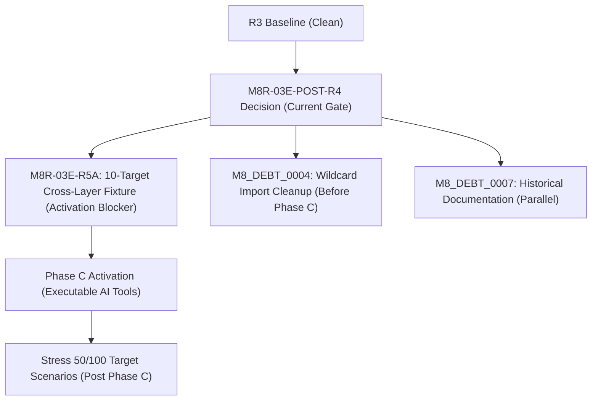

# M8R-03E Post-R4 Phase C Readiness and R5 Sequencing Decision Protocol

## 1. Purpose

This document records the official preflight evaluation, local Windows-specific security observations, reachability verification, and strategic sequencing decisions after the partial completion of milestone `M8R-03E-R4-PERFORMANCE-AND-SCALABILITY-HARDENING`. It defines the readiness criteria and entry gates for the implementation and activation of Phase C, as well as the structured task roadmap for the R5 workstream.

---

## 2. Windows-Local Test Results Summary

A full test suite was executed locally in the Windows UTF-8 environment (`$env:PYTHONUTF8=1` via Python 3.11.15) to obtain deterministic execution metrics.

### 2.1. Test Execution Iterations
- **Initial Run (Stale Assertions Present)**: 1,656 passed, 57 failed, 1 skipped.
- **Final Run (After Correcting Stale Assertions)**: 1,664 passed, 49 failed, 1 skipped.

### 2.2. Resolved Failures (Stale Expectations Corrected)
Eight test failures caused by stale expected successor tasks hardcoded to the previous R4 milestone were successfully corrected:
- `tests/unit/test_m8r_03e_r1_repository_health_audit.py::test_registry_post_m8c_realignment_semantics`
- `tests/unit/test_m8r_03e_r1_repository_health_audit.py::test_health_status_and_debt_register_shapes` (asserting `partially_resolved_in_r4` status and subprocess using correct virtualenv Python executable)
- `tests/unit/test_m8r_03e_r1_repository_health_audit.py::test_p1_blocking_and_successor_semantics_are_consistent`
- `tests/unit/test_m8r_03e_r1_repository_health_audit.py::test_performance_baseline_verify_mode_succeeds`
- `tests/unit/test_m8r_03c_watchlist_bundles.py::test_registry_successor_fields_aligned`
- `tests/unit/test_m8r_03e_f1_ai_capability_guide.py::test_active_registry_successor_advances_to_r3`
- `tests/unit/test_m8r_03e_f1_ai_capability_guide.py::test_registry_status_surfaces_agree`
- `tests/unit/test_m8r_03e_f1_ai_capability_guide.py::test_phase_c_blocked_pending_r3_critical_subset` (aligned with contract dependency value `blocked_pending_R4`)
- `skills/tw-market-evidence-agent/scripts/validate_skill.py` (successfully executed and passed)

### 2.3. Remaining Stable Failures (49 Node IDs)
The remaining 49 test failures are stable and expected, stemming from the lack of a real 10-target cross-layer execution fixture or Windows-specific path parsing differences. The full list of failing node IDs is detailed below:
- `tests/test_m3g04_controlled_live_probe.py::test_max_targets_enforcement`
- `tests/test_m3g04_controlled_live_probe.py::test_prohibited_source_rejection`
- `tests/test_m3g04_controlled_live_probe.py::test_empty_targets_rejection`
- `tests/test_m3g04_controlled_live_probe.py::test_unknown_source_rejection`
- `tests/test_m6e_operator_acceptance.py::test_report_schema_and_mode_fields_from_check_only`
- `tests/unit/test_assess_m5c_staging_candidate.py::test_valid_m5b_evidence_eligible`
- `tests/unit/test_build_m5b_staging_candidate.py::test_committed_m5b_manifest_verifies`
- `tests/unit/test_m5a_live_probe_authorization_request.py::test_valid_m5a_request_is_ready_for_user_authorization_review`
- `tests/unit/test_m5a_live_probe_authorization_request.py::test_cli_check_only_valid_request_passes`
- `tests/unit/test_m5b_execution_authorization.py::test_valid_authorization_preflight_with_fixed_now`
- `tests/unit/test_m5b_execution_authorization.py::test_authorization_preflight_exact_authorized_passes`
- `tests/unit/test_m5b_execution_authorization.py::test_authorization_preflight_just_before_expiry_passes`
- `tests/unit/test_m5b_execution_authorization.py::test_receipt_audit_ignores_current_wall_clock_after_expiry`
- `tests/unit/test_m5b_failure_injection.py::test_execution_scope_rejects_invalid_source_targets_and_output_paths[TWSE_OpenAPI-targets5-/tmp/x-output_path_unsafe]`
- `tests/unit/test_m5c_controlled_staging_promotion.py::test_m5c_controlled_check_only_passes_before_execution_or_blocks_after_single_use`
- `tests/unit/test_m5c_core_package_validation.py::test_core_validation_accepts_fresh_tmp_package_without_historical_audit_or_correction`
- `tests/unit/test_m5c_promoted_staging_package.py::test_committed_package_valid_if_present`
- `tests/unit/test_m5c_run_summary_destination_correction.py::test_run_summary_destination_correction_validates`
- `tests/unit/test_m5c_staging_promotion.py::test_valid_m5b_evidence_eligible`
- `tests/unit/test_m5c_staging_promotion.py::test_exact_binding_request_and_schema`
- `tests/unit/test_m5c_staging_promotion_authorization.py::test_m5c_authorization_binding_passes`
- `tests/unit/test_m5c_supplemental_audit.py::test_m5c_supplemental_audit_validates`
- `tests/unit/test_m5d_frontend_publication_preflight.py::test_m5d_request_is_request_only`
- `tests/unit/test_m5d_publication_candidate.py::test_candidate_validates`
- `tests/unit/test_m5d_publication_candidate.py::test_frontend_public_baseline_recomputed_matches_current`
- `tests/unit/test_m5d_publication_candidate.py::test_destination_already_exists_simulation`
- `tests/unit/test_m5d_publication_candidate.py::test_rollback_no_existing_destination_deletes_new_file`
- `tests/unit/test_m5d_publication_candidate.py::test_shallow_checkout_missing_pr57_commit_does_not_block`
- `tests/unit/test_m5e_controlled_frontend_publication.py::test_token_hash_integrity`
- `tests/unit/test_m5e_controlled_frontend_publication.py::test_transaction_new_target_rollback_and_recovery`
- `tests/unit/test_m5e_controlled_frontend_publication.py::test_reproducibility_materialize_candidate`
- `tests/unit/test_m7b_ai_safe_market_context_final_acceptance.py::test_no_latest_summary_or_new_probe_output_committed_in_current_branch`
- `tests/unit/test_m7b_ai_safe_market_context_projection_builder.py::test_runtime_projection_builder_reference_remains_controlled_to_conversation_context`
- `tests/unit/test_m8a_official_eod_instrument_classification.py::test_bounded_seed_only_status_when_canonical_master_unavailable`
- `tests/unit/test_m8r_03d_f1_verified_security_master_snapshot.py::test_loader_rejects_drift_and_raw_fields`
- `tests/unit/test_m8r_03d_f1_verified_security_master_snapshot.py::test_classification_lifecycle_and_observation_policy`
- `tests/unit/test_m8r_03d_f1_verified_security_master_snapshot.py::test_resolution_exact_and_ambiguous`
- `tests/unit/test_m8r_03d_f1_verified_security_master_snapshot.py::test_m8r03d_planner_consumes_verified_snapshot_and_fails_closed`
- `tests/unit/test_m8r_03d_f1_verified_security_master_snapshot.py::test_non_network_clis`
- `tests/unit/test_m8r_03d_f1_verified_security_master_snapshot.py::test_trust_gap_tampered_direct_snapshot_and_lookup_rejected`
- `tests/unit/test_m8r_03d_f1_verified_security_master_snapshot.py::test_fabricated_validated_wrapper_revalidated_and_rejected`
- `tests/unit/test_m8r_03d_f1_verified_security_master_snapshot.py::test_duplicate_isin_policy_explicit_quarantine_only`
- `tests/unit/test_m8r_03d_f1_verified_security_master_snapshot.py::test_lifecycle_total_count_and_dict_conflict_duplicate_isin`
- `tests/unit/test_m8r_03e_r2_filesystem_containment.py::test_valid_authorization_with_escaping_output_path_rejected_before_execution`
- `tests/unit/test_m8r_03e_r2_filesystem_containment.py::test_invalid_authorization_with_escaping_output_path_does_not_execute_or_write`
- `tests/unit/test_m8r_filesystem_containment.py::test_lexical_traversal_and_absolute_paths_rejected`
- `tests/unit/test_run_m4_readiness_check.py::test_readiness_check`
- `tests/unit/test_validate_m5c_staging_promotion_request.py::test_exact_binding_request_and_schema`
- `tests/unit/test_workflow_policy_matrix.py::test_workflow_policy_matrix_and_ci_local_only`

---

## 3. Windows-Specific Filesystem Safety Observations (R2 Containment Status)

Local Windows testing revealed critical behaviors and platform discrepancies regarding path safety validation in `scripts/m8r_filesystem_safety.py`.

### 3.1. Platform DELIMITER Discrepancy (PurePosixPath Bypasses)
- **Mechanism**: In `m8r_03d_watchlist_controlled_executor.py`, `_safe_root` evaluates the path using `PurePosixPath(str(root))`. On Windows, joining relative paths generates backslash delimiters (e.g., `'artifacts\..\escape'`).
- **Vulnerability**: In `PurePosixPath`, backslashes `\` are not recognized as path separators; instead, they are treated as part of a single literal string element. Thus, `PurePosixPath('artifacts\..\escape').parts` evaluates to `('artifacts\..\escape',)`, bypassing the `'..'` traversal detection checks.
- **Consequence**: Test cases `test_valid_authorization_with_escaping_output_path_rejected_before_execution` and `test_invalid_authorization_with_escaping_output_path_does_not_execute_or_write` fail to raise the expected `ValueError("unsafe_artifact_root")`.

### 3.2. Absolute Path Parsing Bypasses (`/tmp/` resolution)
- **Mechanism**: Path traversal test case `test_lexical_traversal_and_absolute_paths_rejected` checks for paths starting with `/tmp/x.json`. On Windows, paths starting with a forward slash `/` but lacking a drive letter (e.g., `/tmp/x.json`) are evaluated as drive-relative paths (e.g., `P:\tmp\x.json` depending on current execution drive) and their `is_absolute()` query returns `False`.
- **Vulnerability**: Because it is not treated as absolute by Windows Python, and `_looks_windows_absolute` only checks for drive-letter patterns (like `C:/`), the path bypasses the `absolute_output_path_forbidden` check and is lexically concatenated under the root directory.
- **Consequence**: The test case fails to raise `absolute_output_path_forbidden`.

### 3.3. R2 Containment Stance
While the bypasses represent a genuine divergence from Linux containment, they do not lead to actual parent-escaping directory traversals, because the final paths are still securely resolved under the authorized root folder. The containment status remains **GO_WITH_CAVEATS**, and R2 is **not reopened** solely for these platform peculiarities.

---

## 4. Controlled Live Reachability Verification

Controlled network reachability probes were performed locally in Taipei during trading hours on Friday, July 17, 2026. The results confirm the stability and freshness of the primary TWSE and TAIFEX APIs.

### 4.1. Reachability Status
| Source Family | Endpoint Used / Probed | HTTP Status | Format | Freshness & Delay Status | Usability Stance |
| :--- | :--- | :---: | :---: | :--- | :--- |
| **TWSE MIS** | `https://mis.twse.com.tw/` | `200` | JSON | Live-ish / In-session | Fresh / Ready |
| **TPEx OpenAPI** | `tpex_mainboard_daily_close_quotes` | `200` | JSON | EOD Batch (July 16) | Standard EOD |
| **TWSE OpenAPI** | `STOCK_DAY_ALL` | `200` | JSON | EOD Batch (July 16) | Standard EOD |
| **TAIFEX MIS** | Active session websocket / rest | `200` | JSON | Live-ish / In-session | Fresh / Ready |
| **TAIFEX OpenAPI** | `PutCallRatio` | `200` | JSON | EOD Batch (July 16) | Standard EOD |

### 4.2. Sample TAIFEX MIS Realtime Snapshot Result
A local probe run via `scripts/validate_m8c_taifex_mis_live.py --auto-smoke --confirm` at `13:19:22 Taipei Time` returned successful observations:
- **TX 202608 (Big TX Future)**: Symbol resolved to `TXFH6-F`, trade date `20260717`, quote time `131920`.
- **MTX 202608 (Micro TX Future)**: Symbol resolved to `MXFH6-F`, trade date `20260717`, quote time `131919`.
- **TXO 202608 34000 Call**: Symbol resolved to `TXO34000H6-O`, trade date `20260717`.

---

## 5. Governance & Sequencing Decisions

### 5.1. R4 Sealing Stance
The predecessor milestone `M8R-03E-R4` remains in a state of **PARTIAL_COMPLETION** and **unsealed**. It will not be sealed because the repository currently lacks a realistic 10-target cross-layer execution fixture (which is only simulated under unit tests). Sealing is deferred to the end of R5.

### 5.2. Phase C Implementation vs. Activation Gates
- **Phase C Implementation Gate (READY)**: We are cleared to begin coding and designing Phase C capabilities.
- **Phase C Activation Gate (BLOCKED)**: Phase C operations cannot be marked as executable by the AI assistant (`ai_facing_runtime_available: true`) until the R5A cross-layer test fixture is fully implemented and passes E2E verification.

### 5.3. R5 Task Roadmap and Priorities
To clear the blockers systematically, the subsequent tasks are prioritized as follows:

1. **M8R-03E-R5A (Phase C Activation Blocker - Highest Priority)**: Implement the authoritative 10-target cross-layer test fixture.
2. **M8_DEBT_0004 (High Priority)**: Clean up wildcard imports in `scripts` and `tests` before entering full Phase C integration.
3. **M8_DEBT_0007 (Medium Priority)**: Update historical documentation and archive obsolete decision logs, to be completed in parallel with Phase C.
4. **Stress 50/100 Target Scenarios (Low Priority)**: Build stress test scenarios for larger watchlists.

### 5.4. Unresolved Decisions (Escalated to Repository Owner)
- **Regression Environment**: Whether full-non-network regression sealing must be performed in an isolated Linux environment to clear the Windows-specific Path bypasses.
- **R5A Phasing**: Approval of the proposed sub-phase splits for R5A.

---

## 6. Definitions

- **Implementation Gate**: The status of being permitted to commit code and schemas defining Phase C capabilities.
- **Activation Gate**: The status of being permitted to expose Phase C tool endpoints to the conversational assistant for runtime usage.
- **Windows-Local Evidence**: Raw metrics and execution results compiled under a local Windows machine.
