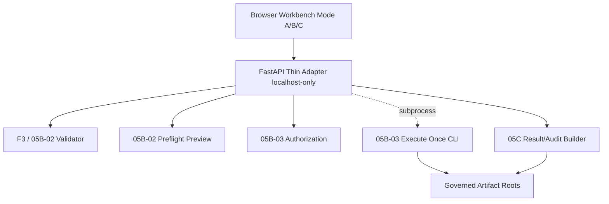
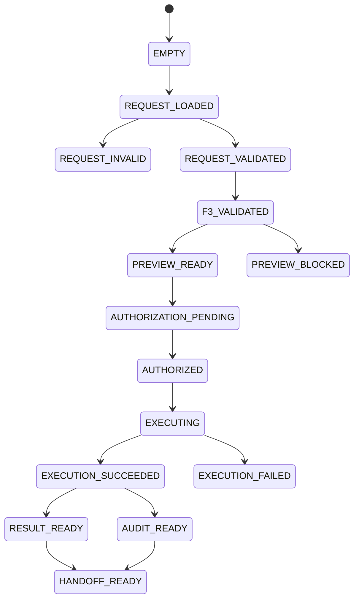

# M8R-06-00 Unified Operator Workbench Preflight

## Executive Decision

**Principal Decision**: `READY_FOR_M8R-06-01-UNIFIED-WORKBENCH-MODE-A-INSPECT-AND-VALIDATE`
**Status**: `PASS_WITH_CAVEATS`
**Next Task**: `M8R-06-01-UNIFIED-WORKBENCH-MODE-A-INSPECT-AND-VALIDATE`

The repository state is ready for the development of the M8R-06 Unified Operator Workbench. A comprehensive assessment of existing frontend, server, MCP, and unified runtime surfaces reveals that all canonical dependencies (M8R-05A through M8R-05C) are properly structured and available for programmatic and CLI consumption.

---

## Repository State & Inventories

### Frontend Inventory
- **Architecture**: Standalone HTML with Vanilla JavaScript. No Vite, React, or complex asset pipelines present.
- **Current Operator Surface**: `frontend/readonly-preview/m5k-workbench.js` / `M5KLocalAIWorkbench.html`.
- **Capabilities**: Contains basic local API clients and read-only JSON/artifact viewers, but lacks execution bridges, explicit operator confirmation UI components, and request editors for Unified payloads.
- **Rules**: Must not introduce a parallel schema. Existing UI is strictly an M5 legacy compatibility component.

### Server / API Inventory
- **Architecture**: FastAPI, bound strictly to `127.0.0.1` / `localhost` (`server/main.py`).
- **Capabilities**: Currently exposes legacy `m5f`, `m5k`, and `m3g` read-only artifact tools, and controlled `subprocess` executions.
- **Gaps**: No generic command runner exists. The startup is fully `no-network` safe. No current `05B` or `05C` endpoints exist, requiring the creation of a new, thin FastAPI adapter.

### MCP Inventory
- **Architecture**: Standard MCP server (`server/mcp_server.py`).
- **Capabilities**: Readonly context tools and bounded live execution via explicit confirmation for legacy probes.
- **Status**: It does not implement `05B/05C` unified runtimes. Using MCP as the Workbench backend is explicitly deferred to Phase E to prioritize browser-based Operator confirmation models.

### Unified Runtime Inventory
The Unified (M8R-05B/05C) runtime exposes authoritative programmatic entry points:
- **Validation**: `scripts/m8r_05b_02/validator.py`
- **Preview**: `scripts/m8r_05b_02/preflight.py` and `scripts/m8r_05b_02/cli.py`
- **Authorization**: `scripts/m8r_05b_03/authorization_gate.py`
- **Execute Once**: `scripts/m8r_05b_03/orchestrator.py` and `scripts/m8r_05b_03/cli.py`
- **Result/Audit**: `scripts/m8r_05c/result_builder.py`, `scripts/m8r_05c/audit_package_builder.py`, `scripts/m8r_05c/cli.py`

---

## Integration Architecture

### Architecture Options Evaluated
1. **Option A: Frontend directly invokes local CLI via privileged browser bridge.** (Rejected due to browser security limitations and the lack of an existing desktop shell).
2. **Option B: Thin local FastAPI Workbench Adapter.** (Recommended)
3. **Option C: Reuse MCP as execution backend.** (Rejected for this phase; MCP lacks robust UI operator confirmation and is deferred to Phase E).

### Recommended Architecture: Option B
**`THIN_LOCALHOST_ONLY_WORKBENCH_ADAPTER_REUSING_CANONICAL_F3_05B_05C_RUNTIME`**

### Process Lifecycle Decision
- **Validation / Preview**: Run `in-process` via Python function calls for low overhead and exact schema/model sharing.
- **Execute Once**: Run as a `subprocess` boundary to guarantee path containment, stdout/stderr isolation, and fail-closed termination.
- **Result Projection**: Run `in-process` for fast readback and JSON schema mapping.

---

## Security & Governance Boundary

1. **Local-only Binding**: The FastAPI adapter must strictly bind to `127.0.0.1`.
2. **Command Allowlist**: Only explicit paths corresponding to the M8R-05B/05C CLIs and functions will be exposed. No generic `execute-command` endpoints.
3. **Path Containment**: All output roots provided to the UI must be normalized, relative to governed artifact directories, and checked for traversal escapes.
4. **Explicit Authorization**: The API cannot execute a network call without a consumed, one-time Authorization Binding.
5. **Raw Payload Boundary**: The AI-ready `Result` must not leak `raw payload` filesystem paths, tokens, or network traces. These remain confined to the `Audit Package`.

---

## State Machine

*Transitions bypassing `AUTHORIZATION_PENDING` to `EXECUTING` are strictly forbidden.*

---

## API Proposal

Proposed Thin Adapter Endpoints (to be added to `server/main.py` or a dedicated `unified_router.py`):

- `POST /api/unified/validate-request` (In-process schema validation)
- `POST /api/unified/validate-targets` (In-process F3 capability mapping)
- `POST /api/unified/preview` (In-process orchestration plan generation)
- `POST /api/unified/authorizations` (In-process token minting)
- `POST /api/unified/executions` (Subprocess `05b_03 cli.py` execution, consumes authorization)
- `GET /api/unified/executions/{execution_id}` (Read execution receipt)
- `GET /api/unified/results/{result_id}` (In-process `05C` read)
- `GET /api/unified/audits/{audit_package_id}` (In-process `05C` read)

---

## Error Model

- **Request syntax / schema error**: Validation Phase. Fixable by operator.
- **Target ambiguity / unsupported capability**: Preview Phase. Fails closed unless modified.
- **Authorization missing / expired / mismatch**: Execution Phase. Strictly fails closed; requires new authorization.
- **Path containment failure**: Security Phase. Fatal.
- **Source/network failure**: Execution Phase. Captured as partial failure in Result; requires Operator audit.

---

## Platform & Testing Considerations

- **Windows-First Considerations**: Subprocess invocation must cleanly resolve Python executables, quote PowerShell paths, and handle UTF-8 encodings. Temporary directories must gracefully resolve atomic rename locks on Windows.
- **Test Strategy**:
  - **Unit**: Verify state transitions and containment in API wrappers.
  - **Integration**: FastAPI route tests against deterministic F3 and `05B` programmatic mocks.
  - **Browser E2E**: Bounded to valid state machine flow (A -> B1 -> B2 -> C).
  - **Security Negative Tests**: Intentional path traversals and authorization replay attempts.

---

## Phase Decomposition (M8R-06 Bounded PRs)

- **M8R-06-01**: Mode A (Inspect and Validate) - Request Editor and offline syntax/schema validation endpoints.
- **M8R-06-02**: Mode B1 (Preview) - F3 capability mapping and Orchestrator Preflight rendering.
- **M8R-06-03**: Mode B2 (Authorize and Execute Once) - Operator confirmation, Auth consumption, and Subprocess bridge.
- **M8R-06-04**: Mode C (Package and Handoff) - Read/View 05C AI-ready Result and separated Operator Audit view.
- **M8R-06-05**: End-to-End Acceptance - Browser fixture integration and negative security checks.

---

## Preflight Acceptance Gates
- ✅ **Gate A**: Canonical contract reuse (JSON Schemas remain the source of truth).
- ✅ **Gate B**: Runtime entry-point availability (05B/05C fully accessible).
- ✅ **Gate C**: Safe local integration boundary (Thin FastAPI wrapper).
- ✅ **Gate D**: No startup network (Offline capable).
- ✅ **Gate E**: Explicit authorization (Guaranteed by 05B-03 CLI).
- ✅ **Gate F**: Result/Audit separation (Guaranteed by 05C).
- ✅ **Gate G**: Legacy isolation (Legacy M5 is unaffected).
- ✅ **Gate H**: Testability (Offline determinism maintained).
- ✅ **Gate I**: Cross-platform viability (Python subprocess).
- ✅ **Gate J**: Phase decomposition (Split into 5 clear PRs).

---

## Caveats and Next Steps
- **Accepted Caveat**: Existing test suite features acceptable legacy failures related to early M5 validation patterns.
- **Next Task**: The exact next task is `M8R-06-01-UNIFIED-WORKBENCH-MODE-A-INSPECT-AND-VALIDATE`.
