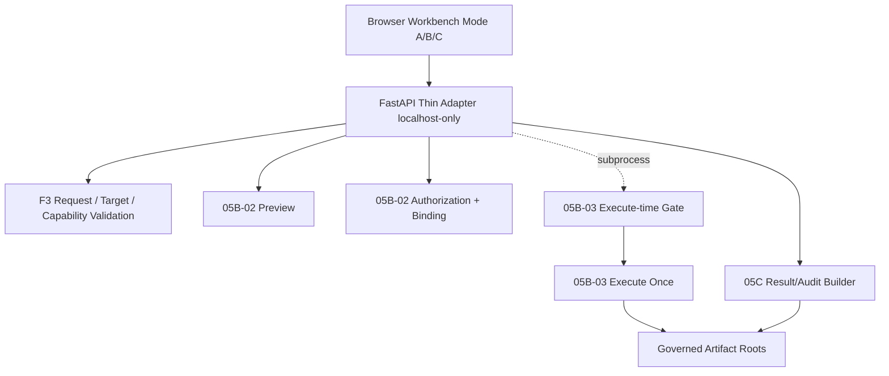

# M8R-06-00 Unified Operator Workbench Preflight

## Executive Decision

**Principal Decision**: `READY_FOR_M8R-06-01-UNIFIED-WORKBENCH-MODE-A-INSPECT-AND-VALIDATE`
**Status**: `PASS_WITH_CAVEATS`
**Next Task**: `M8R-06-01-UNIFIED-WORKBENCH-MODE-A-INSPECT-AND-VALIDATE`

The repository state is ready for the development of the M8R-06 Unified Operator Workbench. A comprehensive assessment of existing frontend, server, MCP, and unified runtime surfaces reveals that all canonical dependencies (M8R-05A through M8R-05C) are properly structured and available for programmatic and CLI consumption.

---

## Repository State & Inventories

### Frontend Inventory
- **Architecture**: Standalone HTML with Vanilla JavaScript. No Vite, React, or complex asset pipelines present.
- **Current Operator Surface**: `frontend/readonly-preview/m5k-workbench.js` / `M5KLocalAIWorkbench.html`.
- **Capabilities**: Contains basic local API clients and read-only JSON/artifact viewers, but lacks execution bridges, explicit operator confirmation UI components, and request editors for Unified payloads.
- **Rules**: Must not introduce a parallel schema. Existing UI is strictly an M5 legacy compatibility component.

### Server / API Inventory
- **Architecture**: FastAPI (`server/main.py`).
- **Capabilities**: `server/main.py` is a **readonly product API** with no execution bridge. Subprocess capabilities reside only in scripts and the MCP wrapper.
- **Gaps**: No generic command runner exists. The startup is fully `no-network` safe. No current `05B` or `05C` endpoints exist, requiring the creation of a new, thin FastAPI adapter.
- **Localhost Bind Policy**: The current documented launch path binds to 127.0.0.1, but `server/main.py` itself does not enforce the socket bind address. The M8R-06 adapter startup wrapper MUST enforce localhost-only binding explicitly.

### MCP Inventory
- **Architecture**: Standard MCP server (`server/mcp_server.py`).
- **Capabilities**: Readonly context tools and bounded live execution via explicit confirmation for legacy probes.
- **Status**: It does not implement `05B/05C` unified runtimes. Using MCP as the Workbench backend is explicitly deferred to Phase E to prioritize browser-based Operator confirmation models.

### Unified Runtime Inventory
The Unified (M8R-05B/05C) runtime exposes authoritative programmatic entry points:
- **Request Intake/Schema Validation**: `scripts/m8r_05a_f3/request_intake.py` (`validate_unified_market_evidence_request`)
- **Target Resolution (F3)**: `scripts/m8r_05a_f3/target_validator.py` (`validate_target`)
- **Capability Validation**: `scripts/m8r_05a_f3/capability_validator.py` (`validate_capability`)
- **Security Master Loading**: `scripts/m8r_05a_f3/security_master_loader.py`
- **Preview**: `scripts/m8r_05b_02/preflight.py` and `scripts/m8r_05b_02/cli.py`
- **Authorization Construction**: `scripts/m8r_05b_02/authorization.py` (`build_execution_authorization`)
- **Authorization Validation**: `scripts/m8r_05b_02/validator.py` (`validate_execution_authorization`)
- **Consumption Binding**: `scripts/m8r_05b_02/consumption_binding.py` (`build_consumption_binding`, `validate_consumption_binding`)
- **Execute-time Gate**: `scripts/m8r_05b_03/authorization_gate.py`
- **Execute Once**: `scripts/m8r_05b_03/orchestrator.py` and `scripts/m8r_05b_03/cli.py`
- **Result/Audit**: `scripts/m8r_05c/result_builder.py`, `scripts/m8r_05c/audit_package_builder.py`, `scripts/m8r_05c/cli.py`. The canonical inputs are: *request, F3 validation, plan, authorization, consumption binding, claim, receipt, bundle, artifact root, output dir*.

---

## Integration Architecture

### Architecture Options Evaluated
1. **Option A: Frontend directly invokes local CLI via privileged browser bridge.** (Rejected due to browser security limitations and the lack of an existing desktop shell).
2. **Option B: Thin local FastAPI Workbench Adapter.** (Recommended)
3. **Option C: Reuse MCP as execution backend.** (Rejected for this phase; MCP lacks robust UI operator confirmation and is deferred to Phase E).

### Recommended Architecture: Option B
**`THIN_LOCALHOST_ONLY_WORKBENCH_ADAPTER_REUSING_CANONICAL_F3_05B_05C_RUNTIME`**



### Process Lifecycle Decision
- **Validation / Preview / Auth Creation**: Run `in-process` via Python function calls for low overhead and exact schema/model sharing.
- **Execute Once**: Run as a `subprocess` boundary to guarantee path containment, stdout/stderr isolation, and fail-closed termination.
- **Result Projection**: Run `in-process` for fast readback and JSON schema mapping.

---

## Security & Governance Boundary

1. **Local-only Binding**: The FastAPI adapter must strictly enforce binding to `127.0.0.1` upon startup.
2. **Command Allowlist**: Only explicit paths corresponding to the M8R-05B/05C CLIs and functions will be exposed. No generic `execute-command` endpoints.
3. **Path Containment**: All output roots provided to the UI must be normalized, relative to governed artifact directories, and checked for traversal escapes.
4. **Explicit Authorization**: The API cannot execute a network call without a consumed, one-time Authorization Binding.
5. **Raw Payload Boundary**: Raw transport payloads remain governed by the existing artifact retention policy and are not embedded into the AI-facing Result. The Audit Package may reference governed artifacts through metadata, hashes, and relative paths.

---

## State Machine

```mermaid
stateDiagram-v2
    [*] --> EMPTY
    EMPTY --> REQUEST_LOADED
    REQUEST_LOADED --> REQUEST_INVALID
    REQUEST_INVALID --> REQUEST_LOADED
    REQUEST_INVALID --> EMPTY
    REQUEST_LOADED --> REQUEST_VALIDATED
    REQUEST_VALIDATED --> F3_VALIDATED
    F3_VALIDATED --> PREVIEW_READY
    F3_VALIDATED --> PREVIEW_BLOCKED
    PREVIEW_BLOCKED --> REQUEST_LOADED
    PREVIEW_READY --> AUTHORIZATION_PENDING
    AUTHORIZATION_PENDING --> AUTHORIZED
    AUTHORIZED --> EXECUTING
    EXECUTING --> EXECUTION_SUCCEEDED
    EXECUTING --> EXECUTION_FAILED
    EXECUTION_FAILED --> [*] : Terminal / Requires New Auth
    EXECUTION_SUCCEEDED --> RESULT_PROJECTING
    EXECUTION_SUCCEEDED --> AUDIT_PROJECTING
    
    RESULT_PROJECTING --> RESULT_READY
    RESULT_PROJECTING --> RESULT_PROJECTION_FAILURE
    AUDIT_PROJECTING --> AUDIT_READY
    AUDIT_PROJECTING --> AUDIT_PROJECTION_FAILURE
    
    RESULT_READY --> RESULT_READY_AUDIT_UNAVAILABLE : IF AUDIT_PROJECTION_FAILURE
    
    note right of HANDOFF_READY
        HANDOFF_READY is a derived state requiring both flags:
        result_ready=true AND audit_ready=true
    end note
    
    RESULT_READY --> HANDOFF_READY : IF AUDIT_READY
    AUDIT_READY --> HANDOFF_READY : IF RESULT_READY
```

### State Constraints & Recovery
- **Forbidden Transitions**: Bypassing `AUTHORIZATION_PENDING` to `EXECUTING` is strictly forbidden.
- **Handoff Prerequisites**: The system cannot enter `HANDOFF_READY` unless both `RESULT_READY` and `AUDIT_READY` are satisfied. If Result is ready but Audit fails, the system enters `RESULT_READY_AUDIT_UNAVAILABLE`.
- **Page Reload Recovery**: Page reloads should return the UI to `EMPTY` or `REQUEST_LOADED` without auto-triggering previews or executions.
- **Authorization Expiry / Consumption**: Once an authorization is consumed or expired (`AUTHORIZATION_CONSUMED` / `AUTHORIZATION_EXPIRED`), any execution failure drops the state to a terminal `EXECUTION_FAILED`, demanding a fresh flow.
- **Projection Failures**: Errors building Result or Audit packages (e.g. `artifact mismatch`) drop the state to `RESULT_PROJECTION_FAILURE` or `AUDIT_PROJECTION_FAILURE`.

---

## API Proposal

### `POST /api/unified/validate-request`
- **Purpose**: Validate syntax and basic schema.
- **Request Body**: Unified Request JSON.
- **Response Body**: Success boolean + validation errors list.
- **Network Behavior**: Offline.
- **Authorization Required**: No.
- **Idempotency**: Idempotent.

### `POST /api/unified/validate-targets`
- **Purpose**: Resolve F3 capability matching.
- **Request Body**: Unified Request JSON.
- **Response Body**: `unified_market_evidence_target_validation.v1`
- **Network Behavior**: Offline.
- **Authorization Required**: No.
- **Idempotency**: Idempotent.

### `POST /api/unified/preview`
- **Purpose**: Generate execution plan.
- **Request Body**: Unified Request JSON.
- **Response Body**: `orchestration_plan.v1` and `preflight.v1`.
- **Network Behavior**: Offline.
- **Authorization Required**: No.
- **Idempotency**: Idempotent.

### `POST /api/unified/authorizations`
- **Purpose**: Construct canonical `unified_market_evidence_execution_authorization.v1` from explicit operator decision input.
- **Request Body**:
  - canonical orchestration plan
  - explicit operator decision input
  - approval scope selection
  - issued/expires timestamps
  - single-use and replay-policy fields
  - owner review reference
- **Response Body**: Canonical execution authorization object.
- **Network Behavior**: Offline.
- **Single-use enforcement**: Performed through canonical authorization fields, consumption binding, and supplied consumption state.
- **Authorization Required**: Operator physical confirmation (UI click).
- **Idempotency**: Idempotent generation of the authorization object.

### `POST /api/unified/executions`
- **Purpose**: Subprocess execute-once wrapper for 05B-03 CLI.
- **Request Body** (may be passed via explicit reference to governed workspace resolving these):
  - orchestration plan
  - execution authorization
  - consumption binding
  - supplied consumption state
  - evaluation timestamp
  - governed output root
  - required runtime snapshots/artifact inputs
- **Response Body**: `execution_receipt.v1` + status.
- **Network Behavior**: Active (Executes live probes).
- **Filesystem Effects**: Writes to governed artifact roots.
- **Authorization Required**: Yes. Must consume token.
- **Idempotency**: Non-idempotent (fail-closed consumption).

### `GET /api/unified/results/{result_id}` & `GET /api/unified/audits/{audit_package_id}`
- **Purpose**: Read 05C generated Result and Audit packages.
- **Network Behavior**: Offline read.

---

## Error Model

| Runtime Error Code | Operator Meaning | Retryability | Required Next Action | Workbench Presentation |
| --- | --- | --- | --- | --- |
| `request_syntax_error` | Invalid JSON or structure | Yes | Edit Request | Inline Editor Warning |
| `target_not_found` | Capability unmatched in F3 | Yes | Fix Target Symbol | Preview Error Block |
| `authorization_consumed` | Replay attack / accidental double execution | No | Start Over | Terminal Alert |
| `authorization_expired` | Operator took too long to execute | No | Start Over | Terminal Alert |
| `plan_hash_mismatch` | Plan was altered before execution | No | Start Over | Fatal Integrity Error |
| `request_hash_mismatch` | Request altered post-authorization | No | Start Over | Fatal Integrity Error |
| `claim_mismatch` | Cryptographic claim failure | No | Audit Logs | Fatal Integrity Error |
| `receipt_mismatch` | Receipt validation failed | No | Audit Logs | Fatal Integrity Error |
| `artifact_mismatch` | Expected artifacts absent/corrupted | No | Audit Logs | Fatal Integrity Error |
| `path_traversal` | Malicious path input detected | No | Audit Logs | Security Violation |
| `network_failure` | Target API timed out or refused | No (requires new auth) | Start Over | Partial Failure / 05C Caveat |
| `partial_evidence` | Some targets failed during execution | Yes (as new flow) | Review Result Caveats | Handled natively by Result UI |
| `result_projection_failure` | Result schema build error | No | Audit Logs | Projection Error Screen |
| `audit_projection_failure` | Audit package build error | No | Audit Logs | Projection Error Screen |
| `unexpected_internal_error` | Code crash | No | Report Bug | Generic Error with Trace ID |

---

## Platform & Testing Considerations

- **Windows-First Considerations**: Subprocess invocation must cleanly resolve Python executables, quote PowerShell paths, and handle UTF-8 encodings. Temporary directories must gracefully resolve atomic rename locks on Windows.
- **Test Strategy**:
  - **Unit**: Verify state transitions and containment in API wrappers.
  - **Integration**: FastAPI route tests against deterministic F3 and `05B` programmatic mocks.
  - **Browser E2E**: Bounded to valid state machine flow (A -> B1 -> B2 -> C).
  - **Security Negative Tests**: Intentional path traversals and authorization replay attempts.

### Test Evidence
- **Command**: `pytest tests -q -k "server or api or mcp or workbench"`
- **Result**: Exit Code 1.
- **Collected Count**: 189 tests.
- **Status**: 1 failed, 188 passed.
- **Exact Failure**: `tests/unit/test_m5b_failure_injection.py::test_execution_scope_rejects_invalid_source_targets_and_output_paths[TWSE_OpenAPI-targets5-/tmp/x-output_path_unsafe]`
- **Cause / Classification**: Assertion error matching `output_path_unsafe` against `{output_outside_m5b, output_must_be_direct_m5b_child...}`. Because PR #178 changes documentation only, this failure was not caused by production-code changes in this PR. It is consistent with the existing legacy failure class documented during M8R-05C closure.

---

## Phase Decomposition (M8R-06 Bounded PRs)

- **M8R-06-01**: Mode A (Inspect and Validate)
- **M8R-06-02**: Mode B1 (Preview)
- **M8R-06-03**: Mode B2 (Authorize and Execute Once)
- **M8R-06-04**: Mode C (Package and Handoff)
- **M8R-06-05**: End-to-End Operator Acceptance

---

## Preflight Acceptance Gates
- 🟢 **Gate A: Canonical contract reuse** -> `PASS`
- 🟢 **Gate B: Runtime entry-point availability** -> `PASS`
- 🟡 **Gate C: Safe local integration boundary** -> `READY_WITH_WRAPPER`
- 🟢 **Gate D: No startup network** -> `PASS`
- 🟡 **Gate E: Explicit authorization** -> `PASS_WITH_REQUIREMENTS`
- 🟢 **Gate F: Result/Audit separation** -> `PASS`
- 🟢 **Gate G: Legacy isolation** -> `PASS`
- 🟢 **Gate H: Testability** -> `PASS`
- 🟡 **Gate I: Cross-platform viability** -> `PASS_WITH_REQUIREMENTS`
- 🟢 **Gate J: Phase decomposition** -> `PASS`

---

## Caveats and Next Steps
- **Accepted Caveat**: Existing test suite features acceptable legacy failures related to early M5 validation patterns.
- **Next Task**: The exact next task is `M8R-06-01-UNIFIED-WORKBENCH-MODE-A-INSPECT-AND-VALIDATE`.
