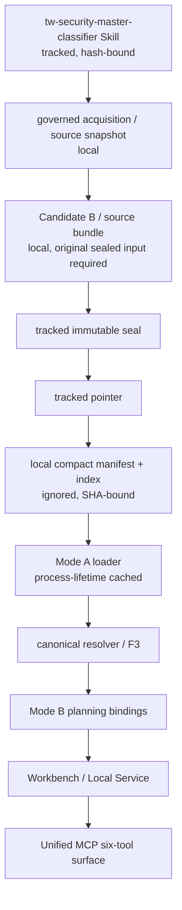
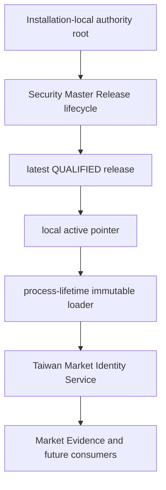

# M8R-08G-00 Architecture Contract & Repository-Wide Impact Inventory

## 1. Executive decision

This is an evidence-only Pre-Phase-F inventory.  The repository has enough
evidence to design M8R-08G-01, but not to start Phase F.  The next safe work is
contract realignment: make an installation-local Taiwan Market Identity Service
explicit, then migrate consumers before changing the portable skills.

## 2. Baseline / branch / scope

- Baseline: `bcf586041a94c2349d6a854410a1813d2669cd7e` (PR #213 merge).
- Branch: `codex/m8r-08g-00-architecture-impact-inventory`.
- Scope: repository evidence, offline validators, and two review artifacts.
- Excluded: market network, Security Master acquisition or reseal, runtime
  changes, skill/AI-guide edits, dependency locking, and persistent watchlist
  implementation.

## 3. Principal architecture decisions

The owner-approved target is an installation-local **Taiwan Market Identity
Service**.  For cash instruments governed by ISIN.twse, ISIN is the future
instrument primary identity; `MARKET:CODE` remains a listing/routing identity.
Candidate/release identity is not instrument identity.  Historical evidence is
preserved rather than rewritten to claim the target model already existed.

## 4. Current Security Master authority chain

`config/m8r_06_mode_a_security_master_pointer.json` selects Candidate B,
requires paths beneath the governed runtime root, and binds the seal, source
lineage, schemas, compact index/manifest SHA-256 values, and coverage counts.
`scripts/m8r_06_01c2_mode_a_security_master_loader.py` fails closed if any
binding or local artifact is missing/malformed.  It constructs the lookup only
after strict validation.  F3 (`scripts/m8r_05a_f3/target_validator.py`) uses
that lookup; Mode B1 reruns F3; Mode C reconstructs only verified predecessors.

## 5. Candidate B coupling analysis

Candidate B is `m8r06-01b-20260903T093604Z`.  The pointer and tracked runtime
seal agree on source bundle/snapshot, source snapshot SHA, source skill contract
hash, compact SHA/schema hashes, record count 46,374, knowledge count 46,374,
runtime-eligible count 2,331, zero quarantined records, and
`artifact_persisted_in_git=false`.  Local `index.json` and `manifest.json` are
Git-ignored runtime dependencies; their tracked seal is authority evidence.

Current-looking references separate into: ACTIVE_RUNTIME/CURRENT_CONFIG (the
pointer and Mode A loader); ACTIVE_TEST (synthetic pointer activation and
resolver/preview tests); CURRENT_DOC (Candidate B materialization/activation
reviews); and HISTORICAL_ACCEPTANCE (G5–G9 and M8R-08F closure).  Candidate B
must be retained as historical/current release evidence during migration, while
consumers migrate to a release-lifecycle authority.  It must not be copied,
reprobed, or silently replaced.

## 6. Current canonical identity model

The compact-index schema requires `canonical_target_id` matching
`TWSE|TPEX:code`; the resolver lookup, F3 output, planner operation binding,
receipt/audit/citation projection, production adapter and request-validation
schema all use it as the current canonical/routing identity.  `identity.isin`,
`security_code`, bilingual names, and CFI are carried alongside it.  There is
no current `canonical_security_id` durable ISIN primary key contract.

## 7. Current versus target identity model

| Concern | Current evidence | Target | Gap / proposed milestone |
|---|---|---|---|
| Instrument primary identity | `canonical_target_id=MARKET:CODE` is canonical in active consumers | ISIN for governed cash instruments | 08G-01 contract; 08G-03 migration |
| Listing/routing identity | market plus code is used end-to-end | retain `MARKET:CODE` as listing/routing | adapter required, 08G-03 |
| Human names | exact normalized names resolve; alias/former-name is skill-level policy | names/aliases are metadata only | 08G-01/03 |
| Release identity | candidate/index/bundle/snapshot/selection IDs overlap operationally | release lifecycle separate from instrument | 08G-02 |

## 8. Knowledge versus execution universe analysis

The compact index preserves 46,374 classified records.  Its coverage counts
records with `execution_eligibility` of `allowed` or `allowed_with_caveat` as
runtime eligible (2,331).  F3 rejects blocked records as quarantined or
unsupported security type.  The classifier understands wider governed types;
the production executor registry has only four equity routes: TWSE/TPEX
`current_observation` and TWSE/TPEX `official_eod_reference`.  This is a real
data-layer split, but it needs an explicit public Identity-Service versus
Execution-Universe contract in 08G-01.

## 9. Lifecycle / alias / listing-history analysis

The classifier accepts ISIN, code, Chinese/English name, and defines resolution
order: exact ISIN, scoped code, normalized name, official alias/former-name,
then candidate-only fuzzy matching.  It records lifecycle events without
overwriting prior market state.  Compact runtime records retain lifecycle data,
but the active runtime does not yet expose a distinct durable instrument/listing
history model.  Alias and listing history must be preserved through migration.

## 10. Local storage boundary

The committed pointer and candidate reviews are Git-tracked.  `data/security_master/input_bundles/`
and `data/security_master/runtime_identity_indexes/` are explicitly ignored by
`.gitignore`; Candidate B's local index/manifest are therefore installation
state, not clone-complete repository data.  This is the core portability
boundary for 08G-02.

## 11. NOT_INITIALIZED / clean-clone analysis

Current clean-clone semantics are fail-closed but are not an explicit
`NOT_INITIALIZED` state.  A present pointer without local artifacts produces a
private `ModeASecurityMasterUnavailable` reason such as `candidate_index_missing`
or `candidate_manifest_missing`, with public Workbench projection
`canonical_security_master_unavailable` (HTTP 409).  Tests construct synthetic
temporary repositories and assert these conditions.  There is no fixture
fallback or implicit acquisition, which is good; the explicit bootstrap state,
portable installation instructions, and non-identity service startup contract
remain P1 pre-Phase-F work.

## 12. Runtime consistency / reload model

Mode A declares `PROCESS_LIFETIME_IMMUTABLE_SELECTION` and
`POINTER_CHANGE_REQUIRES_RESTART=true`.  A lock caches only a successfully
validated runtime.  `reset_production_mode_a_security_master_for_tests()` is an
explicit test-only isolation hook; production has no watcher/reload surface.
This is compatible with build N+1 → qualify → atomic local pointer switch →
controlled restart, but lifecycle ownership and consumer boundaries remain to
be implemented in 08G-02/03.

## 13. Security Master Skill inventory

`skills/tw-security-master-classifier/` is a tracked source contract with
classification, lifecycle, output contracts, source manifest, schemas,
fixtures, parsers and a validator.  The snapshot exporter computes its contract
hash from `SKILL.md`, reference Markdown, source manifest, and schemas using
raw file bytes.  Its offline validator passed 187 checks; it uses fixtures and
redirect-policy objects, not network acquisition.

## 14. Market Evidence Skill inventory

`skills/tw-market-evidence-agent/` contains the portable capability JSON,
generated quick guide, current limitations, tool-selection guidance and a skill
validator.  Its `SKILL.md` still directs manual handoff and says direct Unified
MCP/service execution is unavailable until M8R-06.  That contradicts merged
M8R-08F's six-tool MCP runtime.  Its validator also fails because it compares
the JSON `_archive_status` object to an obsolete string literal.  These are
08G-04 realignment/validator-coverage issues, not reasons to modify a skill now.

## 15. AI Guide / docs drift inventory

`docs/agent_usage_guide.md` repeats that M8R-06 Workbench/MCP, Mode B2 and Mode
C are not implemented and requires manual handoff.  `docs/ai/M8_AI_CAPABILITY_CONTRACT.md`
still presents an older JSON contract as authoritative.  The portable catalog
itself is generated and synchronized, but its historical limitation strings
also mention M8R-06/M8R-05A implementation status.  These are stale current
documentation / duplicate-authority risks, not a runtime regression.

## 16. Portable asset sync / validator analysis

`docs/data_capabilities/unified_market_evidence_capability_catalog.v1.json` is
the canonical source.  `scripts/generate_portable_catalog.py` produces the
portable JSON and guide with a newline-stable canonical SHA; sync validation
deep-compares both projections and passed.  `tests/unit/test_m8r_05a_f2_portable_skill_sync.py`
uses temporary outputs and has LF/CRLF coverage.  The sync validator does not
inspect the narrative statements in SKILL.md or agent guide; therefore it can
pass while documentation says direct MCP is unavailable.  This is a validator
coverage gap for 08G-04.

## 17. MCP / Local Service current authority

The actual static tool contract is:
`market_describe_capabilities`, `market_validate_request`,
`market_preview_request`, `market_read_result`,
`market_export_ai_handoff`, and `market_fetch_evidence`.
The first three describe/validate/preview; read/export verify finalized control
packages; fetch requires `execution_mode=execute` and is otherwise rejected
before Local Service.  Local Service projects committed catalog, routing matrix,
and fixed executor metadata; no generic URL, executor, scheduler, persistence
or trading surface exists.

## 18. M8R-08F semantic preservation map

Merged acceptance evidence covers normal TWSE/TPEX, multi-target execution,
partial success, ambiguity fail-closed behavior, authorization refusal,
source-wide failure, TAIFEX provisional boundary, and stale/currentness.  Code
embeds F3, planner, execute-once, receipt/bundle and Mode C semantics; the
acceptance reviews provide scenario-specific real-agent evidence.  Future skill
text must preserve that execution success is distinct from freshness and from a
realtime guarantee.

## 19. Dependency / environment reproducibility

`requirements.txt` pins only `mcp==1.29.0` and constrains jsonschema below 5;
other major dependencies use lower bounds.  CI workflows use Python 3.11 on
Ubuntu; Windows compatibility smoke also uses Python 3.11.  There is no lock
file or environment manager.  Repository-relative `Path(__file__)` roots are
common in current runtime; no production runtime hard-coded drive-letter path
was found.  Deterministic dependency resolution is P1 work for 08G-05.

## 20. Existing watchlist surface classification

Existing M5N/M8R-03E watchlists are bounded config, conversation-local target
sets, local import/export, and controlled-observation inputs.  The capability
registry explicitly says `m8r_03e_persistent_watchlist_enabled=false`.  None is
Phase-F persistent product storage.  Classification:
`NOT_PHASE_F_PERSISTENT_WATCHLIST`.

## 21. Schema impact matrix

| Schema / contract | Current use | Future disposition |
|---|---|---|
| Mode A pointer | Candidate B local selection and seal binding | MIGRATION_ADAPTER_REQUIRED |
| Compact index / manifest | current `canonical_target_id` plus ISIN metadata | LIKELY_REALIGN |
| F3 request validation | returns canonical target, market, code, ISIN | MIGRATION_ADAPTER_REQUIRED |
| Unified Request target | user input + market hint, no durable ISIN field | NO_CHANGE initially; mapping adapter |
| Preview/plan/receipt/bundle | binds current canonical target IDs | MIGRATION_ADAPTER_REQUIRED |
| Unified Result/audit | projects current canonical target IDs and citations | MIGRATION_ADAPTER_REQUIRED |
| Classifier source schemas | broad identity/classification/lifecycle | RETAIN_AS_AUTHORITY |

## 22. Repository-wide artifact disposition matrix

| Artifact | Role / state | Disposition |
|---|---|---|
| `config/m8r_06_mode_a_security_master_pointer.json` | ACTIVE_RUNTIME, tracked Candidate B selector | MIGRATE_CONSUMER |
| Candidate B runtime seal/reviews | tracked sealed current/historical authority | RETAIN_AS_HISTORICAL |
| ignored Candidate B compact index/manifest | local active runtime artifact | REALIGN |
| Mode A loader / F3 / B1 / B2 / C | active consumers | MIGRATE_CONSUMER |
| classifier Skill and schemas | source classification authority | RETAIN_AS_AUTHORITY then REALIGN consumers |
| market-evidence Skill and agent guide | stale current instructions | REALIGN in 08G-04 |
| canonical capability catalog | committed capability authority | RETAIN_AS_AUTHORITY |
| portable JSON and quick guide | generated projection | GENERATED_PROJECTION |
| M8R-08F reviews | acceptance/historical truth | RETAIN_AS_HISTORICAL |
| old Candidate A reviews/seals | historical evidence, no active fallback | RETAIN_AS_HISTORICAL |

## 23. Dependency graph

The current graph is Section 4.  Hash-bound edges are Skill→snapshot,
snapshot→Candidate seal, seal↔pointer, and pointer→local compact artifacts.
The pointer-selected validated artifact is process-cached.  The boundary between
local compact artifacts and generic consumers is the primary migration boundary.

## 24. Current to target migration graph

No part of this graph is implemented by this task.

## 25. Milestone allocation

- **08G-01:** define ISIN-primary / listing identity, universes, schemas and
  migration compatibility contract.
- **08G-02:** implement installation-local release lifecycle and explicit
  NOT_INITIALIZED state.
- **08G-03:** migrate resolver, F3, planning, Result/audit, Workbench/Local
  Service/MCP consumers.
- **08G-04:** realign portable Skills and AI guides after runtime contracts.
- **08G-05:** lock/reproducibility and clean-clone cross-machine acceptance.
- **08G-06:** final pre-Phase-F closure.

## 26. Critical ordering findings

**Yes.** Any future change to a file included by
`compute_skill_contract_hash()` changes the active classifier Skill hash.  The
exact producer is `scripts/m8r_03d_f1_security_master_snapshot_exporter.py`;
the hash is copied into source snapshot/manifest, Candidate B runtime seal and
the committed pointer.  The exact validator is the Mode A loader's
`_validate_pointer_seal_binding()` plus compact-manifest lineage validation;
the historical seal is the tracked Candidate B
`runtime_identity_immutable_manifest.json`.  A changed skill cannot validate
as the old Candidate B lineage.  Therefore 08G-04 cannot safely be implemented
first: lifecycle/consumer compatibility and new-release migration must precede
skill realignment.

## 27. Portability gap register

1. **P0:** current committed pointer selects ignored machine-local artifacts;
   clean clone has no explicit `NOT_INITIALIZED` bootstrap contract.
2. **P1:** Candidate B/Skill raw-byte hash binding makes independent skill
   evolution invalidate active release validation without a lifecycle migration.
3. **P1:** requirements have mostly lower bounds and no lock; clean-machine
   reproducibility is not deterministic.
4. **P1:** skill/AI-guide narrative is stale despite working MCP runtime; its
   validator has an obsolete archive assertion.
5. **P2:** current schemas use listing identity as canonical, requiring a
   carefully versioned ISIN-primary migration.
6. **HISTORICAL ONLY:** Candidate A original payloads are unavailable; reviews
   preserve history and must not be reconstructed.

## 28. Blockers / non-blocking debt

No unknown blocker prevents design review for 08G-01.  The P0/P1 items above
are explicit design inputs, not Phase-F authorization.  The market-evidence
skill validator failure and stale documentation are retained as 08G-04 gaps.

## 29. Validation performed

- Read all listed governance areas and current implementation authorities.
- `python skills/tw-security-master-classifier/scripts/validate_skill.py`:
  PASS, 187 checks; inspected as fixture/policy-only before running.
- `python scripts/validate_portable_catalog_sync.py`: PASS, deep equality.
- `python skills/tw-market-evidence-agent/scripts/validate_skill.py`: NOT PASS;
  fails its obsolete archive-string assertion, with no mutation.
- No market-facing validator, runtime request, acquisition, or full pytest was
  run.  Final JSON parse and `git diff --check` are recorded with this artifact.

## 30. Proposed next gate

Proceed only to **M8R-08G-01 Taiwan Market Identity Service Contract
Realignment Review**.  Do not start 08G implementation, Phase F, or M8R-09.

